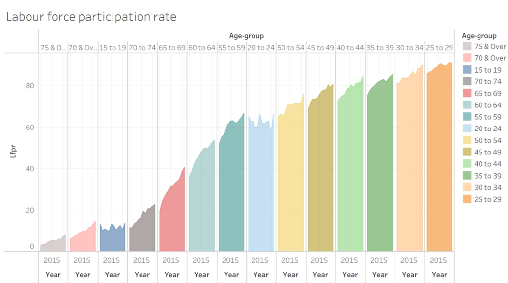
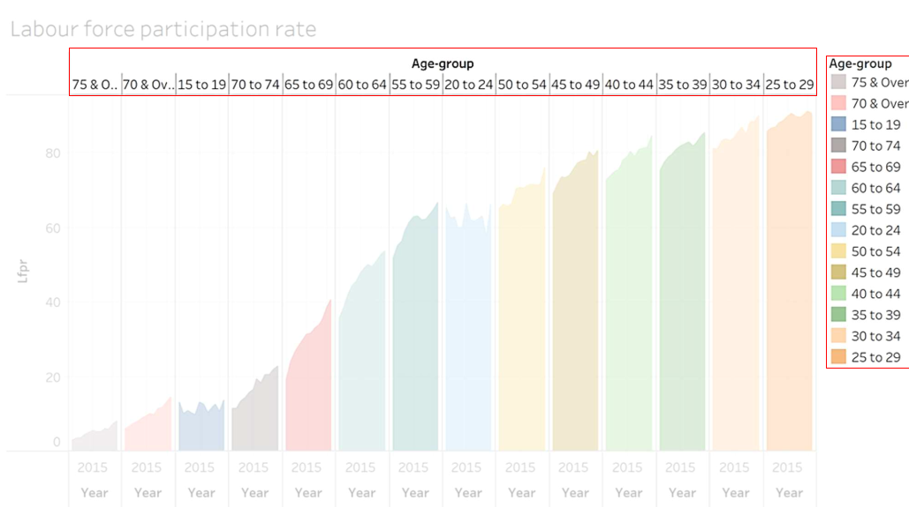
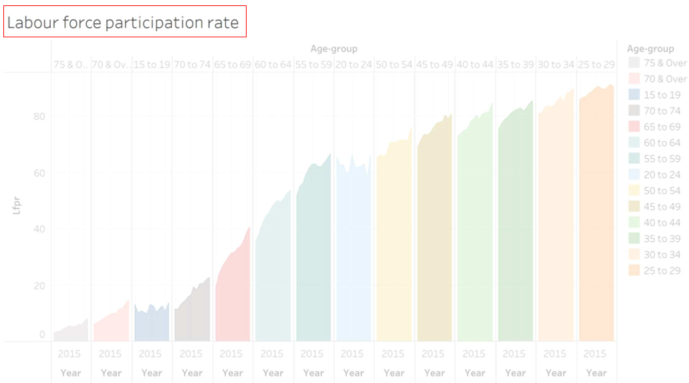
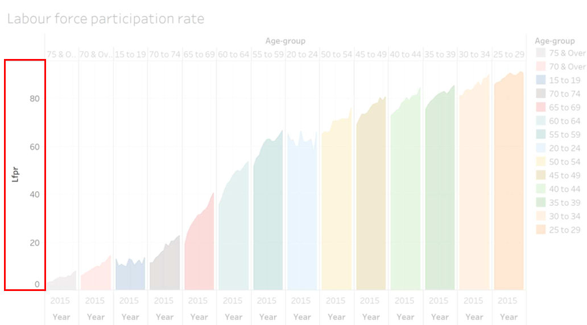
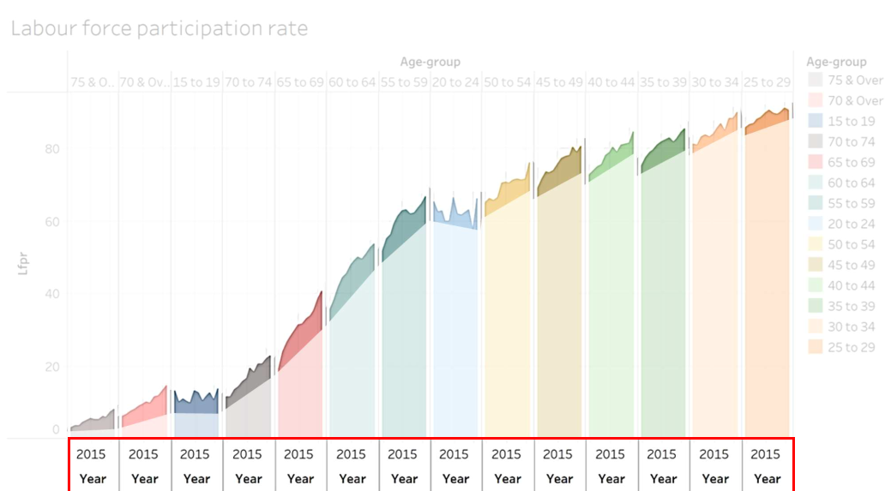
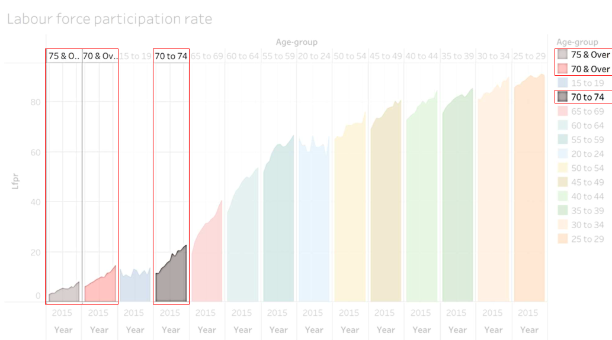
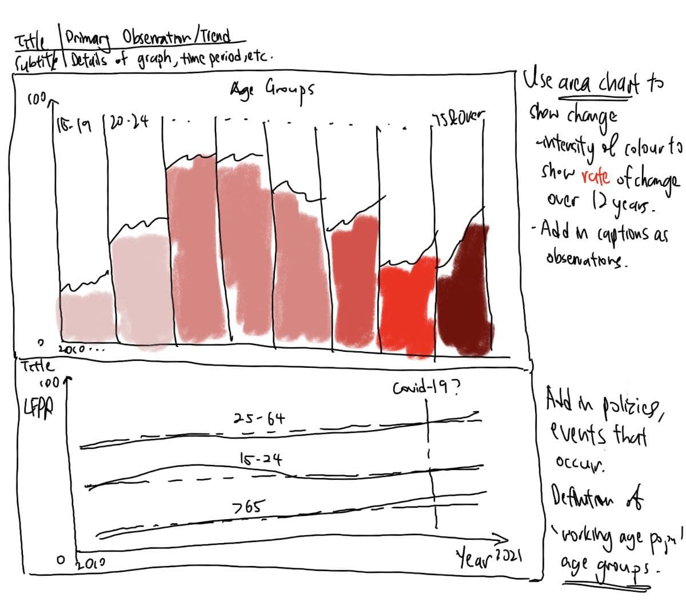
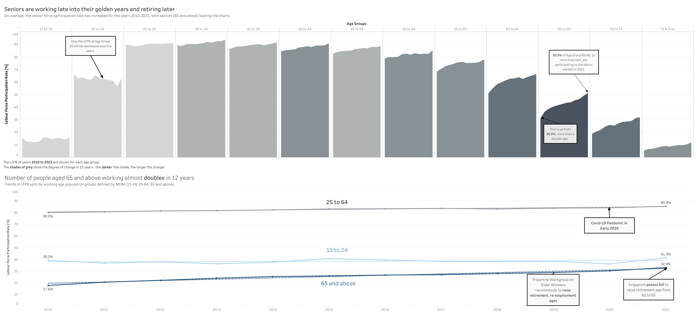
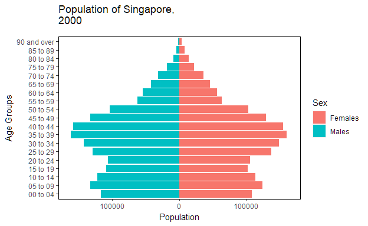

```{r setup, include=FALSE}
knitr::opts_chunk$set(echo = FALSE)
```

```{css, echo = FALSE}
d-article p {
  text-align: justify;
}
```

# 1   Introduction

This data makeover is based on the data provided by the Ministry of Manpower, Singapore (MOM). The data is available on the [MOM website](https://stats.mom.gov.sg/Pages/LabourForceTimeSeries.aspx) in .xlsx (Microsoft Excel) format and is titled **"Resident Labour Force Participation Rate by Age and Sex"**.

For a simple definition, the Labour Force Participation Rate (henceforth referred to as **LFPR**) of an economy is calculated as the labour force (working or looking for work, with minimum 15 years of age) divided by the total age population. It gives an indication of the magnitude of the supply of labour available for the production of goods and services in an economy. 

The data set by MOM comprises of 2 sheets, the first one with the ages banded into distinct categories *"15 to 24"*, *"25 to 54"*, *"25 to 64"*, *"55 to 64"* and *"65 & Over"*. The second sheet comprises of age bands in increment of 5 years, from *"15 to 19"* until *75 & Over*, and also provides the band *70 & Over*.

Both data sets consists of time series data from 1991 to 2021, with the exception of the years **1995**, **2000**, and **2005**. Each sheet consists of the Total LFPR, and also broken down into each gender for *Males* and *Females*.


# 2   Original Data Visualisation

The original data visualisation is shown below.

<center>



</center>

At first glance, the chart seems to be really beautiful, with a proper font, large array of colours, and even a simple title. However, on closer inspection, one cannot really tell what information is meant to be understood from the graph.

The image below is obtained from [Ben Jones](https://dataremixed.com/2012/05/clarity-or-aesthetics-part-2-a-tale-of-four-quadrants/), an author who occasionally write about data visualisation.

<center>


</center>

We can classify any data visualisation into any of these 4 quadrants, on a X scale of **Clarity** and a Y scale of **Aesthetics**. Personally (as rating is subjective), I would put this visualisation into Quadrant IV, as it is *Beautiful* but *Confusing*. We break down each of the criteria, Clarity and Aesthetics, to critique.

## 2.1    Aesthetics

Aesthetics refers to how the graph looks. Looking at the original visualisation, it looks interesting with the many colours.

<center>


</center>

However, there are a couple of points that needs to be critiqued.

### 2.1.1 The area graph does not show anything useful.

The area graph is a useful tool for time series data such as this but is usually used for a single time series or comparison between a few time series data. 

The area should emphasise the overall trend of the data over time. Since there are too many time series data in this chart, it is hard for the user to differentiate across the area charts and see which is the most important.

An area graph to show the trend of the data would be a more appriopriate tool.

### 2.1.2 The axis and legend shows duplicated information

The axis at the top of the graph and the legend is repeated and does not provide any additional information. The labelling should just be present on **either** the main chart or the legend and not both, with no truncation such as **"75 & O.."** and **"70 & Ov.."**.

<center>



</center>


### 2.1.3 There are too many colours on the graph

Choice of colour plays a major factor in creating visually appealing charts. The colours should highlight the story that the creator wants the data to tell, and enhance the message. Colours are usually used for categorical data, 

For this chart, the colours are not meaningful and hence should be avoided. 

## 2.2    Clarity

The chart is also unclear on the following points.

### 2.2.1 The title does not convey any useful information

<center>



</center>

A chart is supposed to convey a message to the audience. However for this chart, the title, **"Labour Force participation rate"**, does not give any message to the reader. If the creator of the chart just wanted to show the LFPR, he could use a table just like the original data set that MOM provided. Anybody without prior knowledge would not know what Labour force participation rate means, and hence would not understand the chart.

### 2.2.2 Both axes are not labelled properly 

<center>



</center>


The y-axis mentions a single word **"Lfpr"**, it should be in full (Labour Force Participation Rate) instead of abbreviated. Unless the reader is familiar with this statistical measure from MOM, he or she will not know what it means. Hence, it is advised to use the full text in all labels unless it is an abbreviation universally well known, such as *EU* or *USA*.

Furthermore, y-axis does not show any units. LFPR should be in terms of *percentage* hence there should be a "%" either at each of the labels, or the axis title itself.

<center>



</center>


On the other hand, the x-axis only shows the year 2015. It can be seen from the chart that there is a line with area graph that varies along the x axis, hence it would most likely be showing the change in LFPR over time. To solve this issue, the creator should have either rotated the x-axis labels or combined the labels together, as the chart is not wide enough to show its axis labels.

### 2.2.3 The age groups are not sorted in order

<center>


</center>

Age Groups are sorted from least LFPR to highest LFPR, and hence there is no sense of consistency: *"70 & over"* transitions to *"15 to 19"*, and the last category is *"25 to 29"*. 

The graph should have be arranged according to Age Groups instead, either ascending or descending age - *"15 to 19"* could have been first and *"75 & Over"* last.

Additionally, there are overlapping age groups due to the way the raw data is structured. *"70 & Over"* consists of both *"70 to 74" and "75 & Over"* but both are plotted on the same graph. They should be separated, either by only plotting *70 & Over*, **or** plotting *70 to 74 with 75 & Over*.

<center>



</center>

# 3    Proposed Design

## 3.1 Sketch of Design

The proposed sketch is shown below.



We will create two charts, one with an **area graph** to show how we can improve and work on the original area chart, and the other is a **line graph** to further illustrate the events, change in LFPR in distinct age groups defined by MOM. Since the chart is in **static** form, we will make use of *Titles* and *subtitles*, *captions* and *annotations* to drive our point across at a glance.

## 3.2 Advantages of Design

The proposed design addresses the following issues mentioned above:

1. *The area graph does not show anything useful*

**Area graphs** will be used but shaded accordingly to emphasise the rate of change of LPFR over time. 

2. *The axis and legend shows duplicated information*

The chart will directly show each of the age groups, with a legend denoting the shade of colour corresponding to the **change in LFPR**.

3. *There are too many colours on the graph*

The graph will show separate **hues** or **shades**, to denote the magnitude of change in LFPR over time.

4. *The Title does not convey any useful information*

The key message of the chart will be conveyed, to the point. It will state the **purpose** of the chart to allow the reader to know what to look out for in the chart.

5. *Both axes are not labelled properly*

The chart will have the same y-axis but with proper units (%) and labels. For the x-axis, the time series will show the whole range of data, and with labels **every 5 years**.

6. *The age groups are not sorted in order*

Since line graphs are used for the chart, the age groups will be labelled properly. A **secondary graph** will also show the distinct working age groups that are used for comparison. We will show a trendline on the secondary graph to check the overall trend of the data.

## 3.3 Proposed Visualisation on Tableau

Please view the designed and proposed visualisation on [**Tableau Public**](https://public.tableau.com/app/profile/heng.guang.sia/viz/ex001_16447575478820/Dashboard1).


```{r layout = "l-page", fig.width=8, fig.height=4.5}

```

#   4 Building the Visualisation

The table below shows a step by step description on how to prepare the data visualisation. Please right click to view the full image if they are too small.

<table>
<tr>
  <th>No</th>
  <th>Step</th>
  <th>Action</th>
</tr>

<tr>
  <td colspan="3">**Data Manipulation in Excel**</td>
</tr>

<tr style="height:50px">
  <td>1</td>
  <td>Download the data set from MOM website titled **Resident Labour Force Participation Rate by Age and Sex**.</td>
  <td></td>
</tr>

<tr>
  <td>2</td>
  <td>Open the file in Microsoft Excel. The bottom should contain a total of 2 tabs, namely "mrsd_Res_LFPR_1" and "mrsd_Res_LFPR_2".</td>
  <td></td>
</tr>

<tr>
  <td>3</td>
  <td>You should be greeted with this table on the first Tab, "mrsd_Res_LFPR_1". We will now clean the data so that we can use it in Tableau easily.</td>
  <td></td>
</tr>

<tr>
  <td>4</td>
  <td>Delete rows **1 and 2**, by clicking on the row numbers (drag and select) on the left side, or use Ctrl to click it one by one. Right click on the selection and click Delete.</td>
  <td></td>
</tr>

<tr>
  <td>5</td>
  <td>Similarly, delete rows **8 to 30** as this will not be needed in the visualisation.</td>
  <td></td>
</tr>

<tr>
  <td>6</td>
  <td>Delete rows **2, 5 and 6** as they are repeated age groups and will not be used in the visualisation.</td>
  <td></td>
</tr>

<tr>
  <td>7</td>
  <td>Since we are only using the data from *2010-2021*, delete columns **B to U** which consists of data from *1991 to 2009.*</td>
  <td></td>
</tr>

<tr>
  <td>8</td>
  <td>Similarly, we will clean the data for the Sheet **"mrsd_Res_LFPR_2"** on the second tab.</td>
  <td></td>
</tr>

<tr>
  <td>9</td>
  <td>Delete rows **1 and 2**, by clicking on the row numbers (drag and select) on the left side, or use Ctrl to click it one by one. Right click on the selection and click Delete.</td>
  <td></td>
</tr>

<tr>
  <td>10</td>
  <td>Similarly, delete rows **17 to 57** as this will not be needed in the visualisation.</td>
  <td></td>
</tr>

<tr>
  <td>11</td>
  <td>Since we are only using the data from 2010-2021, delete columns **B to U** which consists of data from 1991 to 2009.</td>
  <td></td>
</tr>

<tr>
  <td>12</td>
  <td>Lastly, we delete rows **2** (*Total*) and **14** (*70 & Over*) as we do not want our data to overlap for the first visualisation. Save the file and close it.</td>
  <td></td>
</tr>

<tr>
  <td>13</td>
  <td>On Tableau Desktop, click and hold to drag your data from your File Explorer to the Tableau window. The data should be imported.</td>
  <td></td>
</tr>

<tr>
  <td colspan="3">**Charting in Tableau**</td>
</tr>

<tr>
  <td>14</td>
  <td>In the Connections pane, click and drag "mrsd_Res_LFPR_2" to the data tab and check the Cleaned with Data Interpreter to allow Tableau to do its magic in interpreting the data.</td>
  <td></td>
</tr>

<tr>
  <td>15</td>
  <td>For Chart 1, create a new Sheet and name it **Area Chart**. Drag '*Measure Names*' to the '*Columns*' and '*Measure Values*' to the '*Rows*' shelves.</td>
  <td></td>
</tr>

<tr>
  <td>16</td>
  <td>Remove **CNT(mrsd_Res_LFPR_2)** from the Measure Values shelf, so that it only contains the Years 2010-2021.</td>
  <td></td>
</tr>

<tr>
  <td>17</td>
  <td>Drag **Age(Years)/Sex** to the *Marks* tab so that we can see the differentiation by Age Groups.</td>
  <td></td>
</tr>

<tr>
  <td>18</td>
  <td>On the Top Right corner, click on Show Me and select the **side-by-side** bars chart.</td>
  <td></td>
</tr>

<tr>
  <td>19</td>
  <td>Change the *Marks* type to **Area** Chart</td>
  <td></td>
</tr>

<tr>
  <td>20</td>
  <td>We will now want to create a calculated field to show the change in LFPR over time. On Tableau, go to Analysis and click on **Create Calculated Field** or press Alt + A + C on your Windows keyboard. </td>
  <td></td>
</tr>

<tr>
  <td>21</td>
  <td>Name the calculated field **LFPR Gradient**. Since the gradient is calculated as the change in LFPR over time, we use the difference in 2021 and 2010 values, divided by the time span of 12 years. Key in the formula **([2021]-[2010])/12** and click OK.</td>
  <td></td>
</tr>

<tr>
  <td>22</td>
  <td>Drag the LFPR Gradient field to the **Colour** in the *Marks* shelf. Click on Colours to edit. We want to show the intensity of the change over time, hence we will select a **Gray** Palette with five steps in colours.</td>
  <td></td>
</tr>

<tr>
  <td>23</td>
  <td>We will now tidy up the graph. Right click the y-axis and edit it, changing the title to **Labour Force Participation Rate** and subtitle to %. We also fix the range from **0 to 100** for a full comparison.</td>
  <td></td>
</tr>

<tr>
  <td>24</td>
  <td>On the x-axis, we want to rename the Top Heading. Right click on *Age(Years)/Sex* in Data and rename it to **Age Groups**. Remove the *year* markings by right clicking the bottom axis and unchecking *Show Header*. We will add the meaning to the caption later.</td>
  <td></td>
</tr>

<tr>
  <td>25</td>
  <td>Edit the Title and Subtitle to convey the meaning of the proposed chart. Add **Captions** and **Annotations** (Right Click chart) to further clarify the intent.</td>
  <td></td>
</tr>

<tr>
  <td>26</td>
  <td>We will now use the first sheet of the Excel file. Go to the Data Source Tab in Tableau and Click **Data > New Data Source** or press Ctrl + D to select the same file. For this source, drag **mrsd_Res_LFPR_1** into the main window. As usual, check the *Cleaned with Data Interpreter* box. </td>
  <td></td>
</tr>

<tr>
  <td>27</td>
  <td>Remove **Select the columns 2010-2021 and **Pivot** the data as shown.</td>
  <td></td>
</tr>

<tr>
  <td>28</td>
  <td>Change the Pivot Field Names to **Date**.</td>
  <td></td>
</tr>

<tr>
  <td>29</td>
  <td>Create a new sheet in Tableau and name it **Line Chart**. Drag '*Pivot Field Names*' to '*Columns*' and '*Pivot Field Values*' to the '*Rows*' shelves. Change the chart type to **Line**.</td>
  <td></td>
</tr>

<tr>
  <td>30</td>
  <td>Rename *Age (Years)/Sex* in Data to Age Groups and drag it into the **Color** in the Marks shelf. Edit the Title, Subtitle, x-axis and y-axis and add annotations like in the previous chart.</td>
  <td></td>
</tr>

<tr>
  <td colspan="3">**Preparing to upload to Tableau Public**</td>
</tr>

<tr>
  <td>31</td>
  <td>Create a Dashboard in Tableau. Drag both Area Chart and Line Chart to the work area. Show captions, and adjust layout and font sizes as necessary to fit into your visualisation.</td>
  <td></td>
</tr>

<tr>
  <td>32</td>
  <td>Click on Data > "Sheet Name" > Extract Data and extract the data to the same folder where you saved the Tableau file. </td>
  <td></td>
</tr>

<tr>
  <td>33</td>
  <td>Once everything is done, upload to the visualisation to Tableau Public (have to be logged in)</td>
  <td></td>
</tr>

</table>


# 5   Concluding Remarks and Observations

### Seniors are working late into their golden years

As seen from the chart, the shades of grey indicate the magnitude of the change in LFPR over the years - the **darker** the shade of grey, the higher the **rate of change** (taken as change in LFPR over the 12 years time period). Broadly, the increase has happened throughout all age bands except 20 to 24 age group. The increase is therefore largest in the 65 to 69 age group, which is the start of our seniors' golden years. 

This can be attributed to two main reasons, the **increasingly aging population** with longer life expectancy, hence seniors are increasingly facing the need to work longer to support themselves. Secondly, with the government encouraging seniors to continually work while they can to support themselves, by proposing and passing bills to **raise the retirement ages** for seniors.

From the trend line plotted, we can see with high confidence that the trend will continue and the labour force size will remain strong for our seniors. 

### The Covid-19 Pandemic did not affect LFPR

Although it is expected that the **employment rates** during Covid-19 period will **decrease** due to a recession, the **labour force participation rate** (a sum of employed and unemployed workers) **did not significantly decrease.** This shows a healthy mix of policies between SGUnited Jobs and Skills package, Jobs Support Scheme and Jobs Growth Incentive for companies to alleviate their financial situation and to keep their workers employed to their best extent. 

### People in their early twenties are less likely to work over time

There are increasingly many youths taking up **higher education courses**, which falls into this particular age group. Especially during the Covid-19 pandemic, many of them continued to take up more education classes such as diploma courses and postgraduate courses. However, some of them will still be taking on part time or temporary work on the sides, and hence there is still a sizeable percentage computed in the LFPR.  

### Cross comparison with Population Pyramid

From the previous [Take Home Exercise 2](https://hengguang-608.netlify.app/takehome_exercise/ex002/ex002), we visualised how the population pyramid of Singapore looks like over time. 



From the animation above, we can see the increasingly aging population of Singapore, and hence understand why there is a **need to increase the retirement ages** for seniors to continually support themselves before retirement. With more advanced healthcare and good infrastructure, [life expectancy in Singapore at 65 years](https://tablebuilder.singstat.gov.sg/table/TS/M810501) is also increasing at *19.8 years in 2021* compared to *21.5 in 2020*, which directly means that there is theoretically a longer time from retirement age and hence a need to build up one's retirement nest egg.

# References

[Distill for R Markdown](https://rstudio.github.io/distill/)

[Dataviz Makeover 1 by Kelly](https://public.tableau.com/app/profile/kelly2850/viz/DatavizMakeover1_16220368938730/Dashboard1)

[Singstat Table Builder for Life Expectancy](https://tablebuilder.singstat.gov.sg/table/TS/M810501)

[Labour Force in Singapore, 2021 edition, MRSD, MOM](https://stats.mom.gov.sg/iMAS_PdfLibrary/mrsd_2021LabourForce.pdf)

[Labour Force Definition by MOM](https://stats.mom.gov.sg/SL/Pages/Labour-Force-Introduction.aspx)

[Bill passed for higher retirement and re-employment ages, Channel News Asia](https://www.channelnewsasia.com/singapore/retirement-reemployment-ages-older-workers-manpower-minister-tan-see-leng-2285771)
