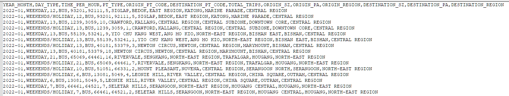
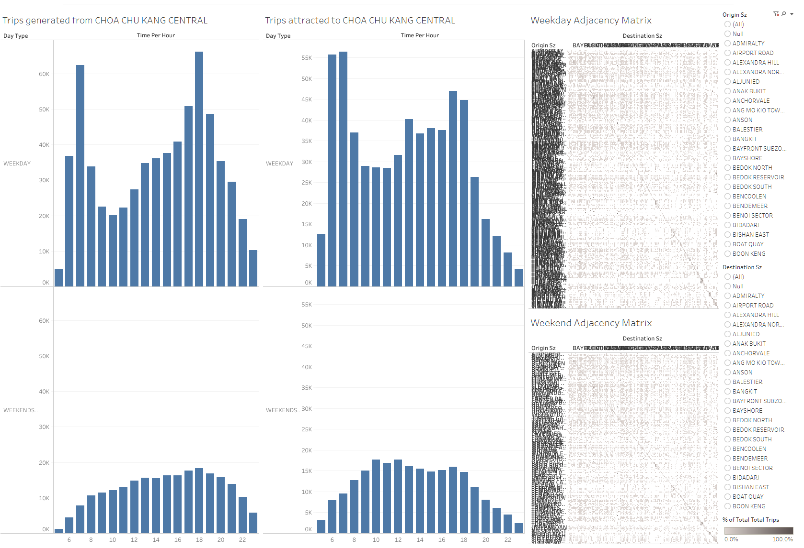
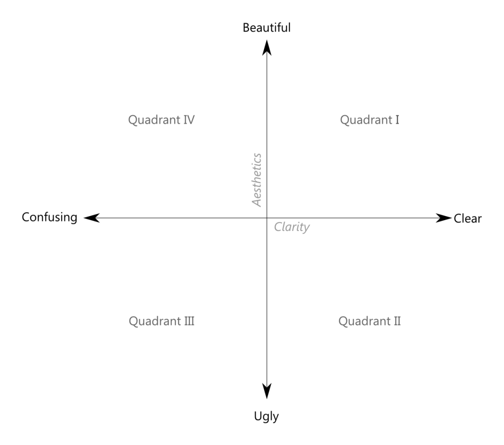
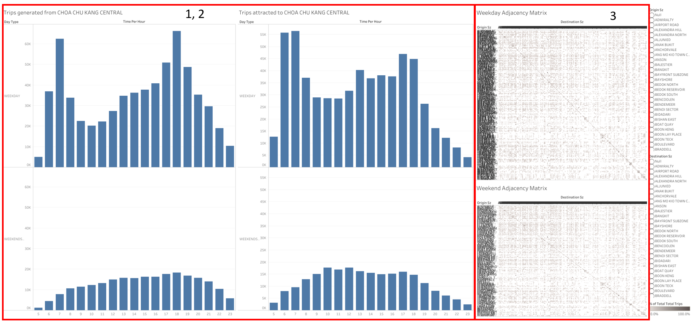
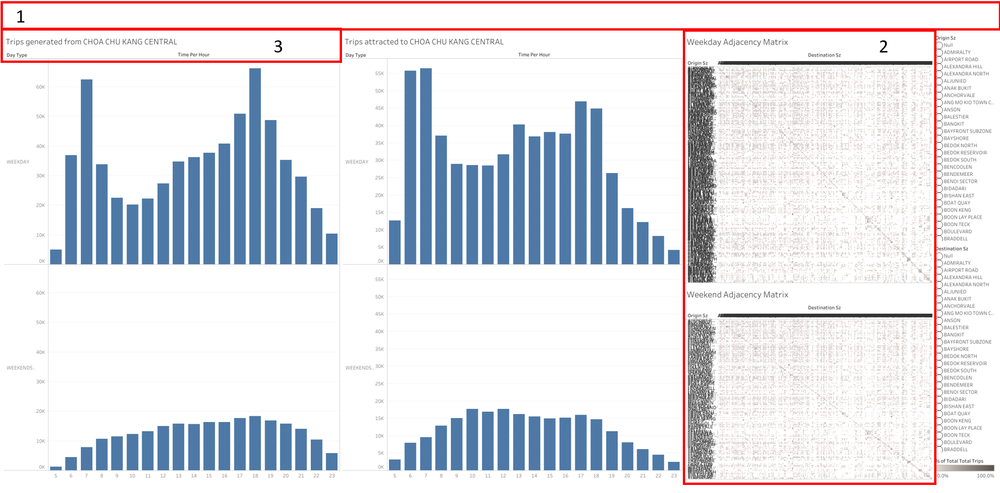
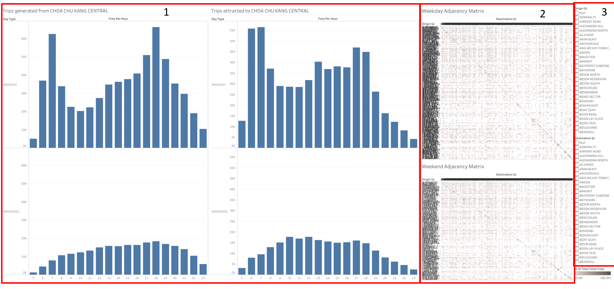
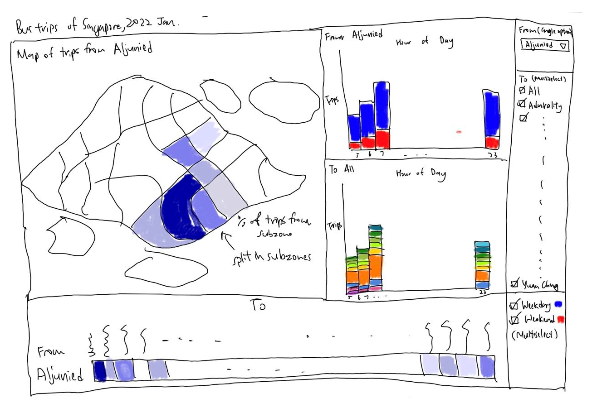
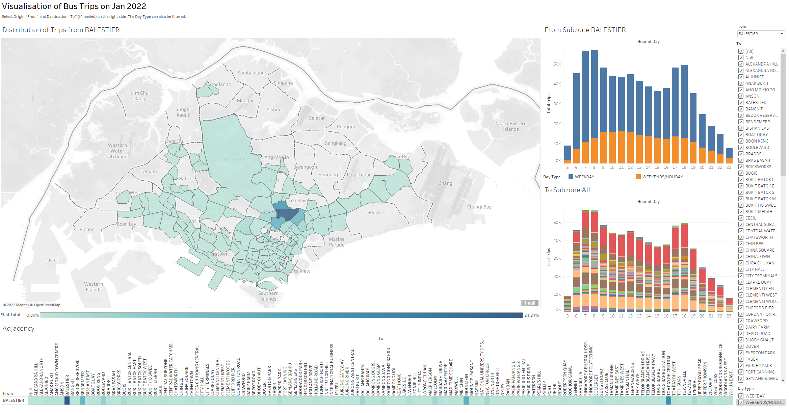

```{r setup, include=FALSE}
knitr::opts_chunk$set(echo = FALSE)
```

```{css, echo = FALSE}
d-article p {
  text-align: justify;
}
```

```{r}
packages = c('knitr')

for (p in packages){
  if(!require(p, character.only = T)){
    install.packages(p)
  }
  library(p, character.only = T)
}
```


# 1   Introduction

This data makeover is based on the bus trips data given by Professor Kam Tin Seong, downloaded from LTA Datamall and URA region, planning area and planning subzone information were added by using GIS Overlay operation.

The .shp file is also given, which contains the URA Master Plan 2014 Planning Subzone boundary map in ESRI shapefile format.

The bus trips dataset compiles the Bus Trips of Singapore for 2022 January, with additional details such as the origins and destinations. The Origin and Destination information is given in terms of Bus Stop numbers, Planning Area, Planning Regions and further broken down into Subzones as seen in the figure below.


```{r, fig.width=8, fig.height=4.5}

```

# 2   Original Data Visualisation

The original data visualisation is shown below.

<center>



</center>

At first glance, the chart is really confusing. I will go through why this is so.

The image below is obtained from [Ben Jones](https://dataremixed.com/2012/05/clarity-or-aesthetics-part-2-a-tale-of-four-quadrants/), an author who occasionally writes about data visualisation.

<center>



</center>

We can classify any data visualisation into any of these 4 quadrants, on a X scale of **Clarity** and a Y scale of **Aesthetics**. Personally (as rating is subjective), I would put this visualisation into Quadrant III, as it is *Ugly* and *Confusing*. We break down each of the criteria, Clarity and Aesthetics, and also add an element of Interactivity, to critique.

## 2.1    Aesthetics

Aesthetics refers to how the graph looks. There are a couple of points that needs to be critiqued.


```{r, fig.width=8, fig.height=4.5}

```


### 2.1.1 Bar graphs are not useful for this visualisation

Bar graphs are useful tools to show the frequency or occurrence of items. For a single colour, it is assumed to be one single value. However, this bar graphs actually shows the aggregate trips for each hour and does not break down the data further into which subzone.

A stacked bar chart will be more appropriate, breaking down into the type of day and the different subzones. 


### 2.1.2 The details of the bar graphs are confusing

For a data visualisation, colour is very important to emphasise at a glance to the viewer on the key points. This graph does not have multiple colours, and hence there is no focus for the reader. Also, the x axis consists of skips in the labels, and it is not sure where it starts and ends. The axis title "Time Per Hour" will be inferred Number of Times per Hour but should actually be "Hour of Day".

Similar to above, a stacked bar chart will be better breaking down into the type of day and different subzones, with each of the categories having a separate colour to distinguish the features.


### 2.1.3 The adjacency matrix is too cluttered

As it seems like all of the data is being plot on the adjacency matrix at the same time, the static chart is hard to read properly. The figure size is too small to accomodate all of the 304 subzones and the viewer can not possibly see any details, despite the legend at the bottom right.

The adjacency matrix should be dynamic and sized appropriately based on input.


## 2.2    Clarity

The chart is also unclear on the following points.

```{r, fig.width=8, fig.height=4.5}

```

### 2.2.1 The Visualisation does not contain any title

A title is supposed to convey a message to the audience. However for this chart, there is no title given. Hence, it is hard for the viewer to infer what the chart is trying to show and hence the viewer has to spend extra attention to see what is going on with the visualisation.

An appropriate chart title like "Bus Trips in January 2022 for Subzones XXXX" would be a better title.

### 2.2.2 Nothing can be inferred from the Adjacency Matrix

Since the font sizes are so small, it is not clear what the matrix is trying to show. Although a legend in greyscale is provided at the bottom right corner, none of these points are discernible on the plot and it is hard to tell one row of data from another.

The adjacency matrix should hence only show relevant information.

### 2.2.3 The bar chart title does not make sense

Chart Titles shall also be clear to inform the viewer the headings for each chart. It is not clear what "generated from" and "attracted to" means in the original visualisation, and whether there is a linkage between the two. Upon further testing, both of the charts are unrelated although the title make it seem like it is.

The chart should hence be more clear and indicate from which subzone to which subzone.

## 2.3    Interactive Design

The chart is supposed to be interactive, but falls short due to the following points.

```{r, fig.width=8, fig.height=4.5}

```

### 2.3.1 The charts do not interact with each other

Although it seems like the bar graphs are linked, the charts are actually independent. The bar charts and the adjacency matrix are also not linked, which defeats the purpose of having an interactive visualisation.

Hence, a better idea would be to synchronise the input, such as highlighting to show how each of the charts link to each other.

### 2.3.2 The adjacency matrix does not readjust based on the filters

The adjacency matrix seems to be fixed although one expects that the filters will help to adjust it to the relevant context. Furthermore, clicking on the adjacency matrix does not show anything or is too small to do so. 

A better way to incorporate interactivity is to filter the adjacency matrix based on the selected subzones.

### 2.3.3 There are too many rows for the filters

Since there are 304 subzones, it is not practical and quite ugly to include all of the subzones especially since the filter is supposed to be a single selection. 

For a single selection, a single-select dropdown list can instead be provided to reduce clutter.


# 3    Proposed Design

## 3.1 Sketch of Design

The proposed sketch is shown below.

```{r layout = "l-page", fig.width=8, fig.height=4.5}

```

For this dashboard, we will create a total of four visualisations, of which two are bar graphs. Since there is interactivity involved, we will also create a dropdown list for selecting the From subzone and a filter for To subzones. We will also add a Weekday/Weekend filter to keep in line with the intention of the original visualisation.

## 3.2 Advantages of Design

The proposed design addresses the following issues mentioned above:

1. *Bar graphs are not useful for this visualisation*

For the bar graph, a stacked bar graph is used to visualise the destinations of the subzones. For the origins of the subzones, they are segregated into Weekday and Weekends. 

2. *The details of the bar graphs are confusing*

The bar chart title will be renamed to Hour of Day, with each of the values explicitly stated. There will also be stacked graphs to show the differences in day and hour.

3. *The adjacency matrix is too cluttered*

The matrix will be simplified with the title removed, and this will adjust accordingly based on the filtered criteria. Only a single row will be shown each time.

4. *The Visualisation does not contain any title*

The key message of the visualisation will be given. It will show the audience what to expect and also how to interact with the design.

5. *Nothing can be inferred from the Adjacency Matrix*

The adjacency matrix will show the percentage of trips from the origin subzone to each of the destinations based on the filtered criteria.

6. *The bar chart title does not make sense*

A stacked bar chart will be used for both the origin and destination subzones. For the origin subzone, the data will be split into both weekday and weekends/holidays. For the destination subzones, it will be filtered based on the number of total trips.

7. *The charts do not interact with each other*

A highlighting action will be added for the viewer to see how each of the chart interacts when hovered over. The charts will be linked and this will be very clear to the viewer on how each of the chart shows the information differently.

8. *The adjacency matrix does not readjust based on the filters*

As mentioned above, the adjacency matrix will be reduced based on the filtered origin and destination subzones.

9. *There are too many rows for the filters*

For the origin subzone, only a single select option is given. This will reduce clutter and the input can be easily seen without the need for scrolling. For the destination subzone, all the rows are still needed if the user intends to deselect some of the options to check the revised % of Total Trips from the origin subzone.


## 3.3 Proposed Visualisation on Tableau

Please view the designed and proposed visualisation on [**Tableau Public**](https://public.tableau.com/app/profile/heng.guang.sia/viz/DataVisualisation2-BusTrips/Dashboard1).


```{r layout = "l-page", fig.width=8, fig.height=4.5}

```

#   4 Building the Visualisation

The table below shows a step by step description on how to prepare the data visualisation. Please right click to view the full image if they are too small.

<table>
<tr>
  <th>No</th>
  <th>Step</th>
  <th>Action</th>
</tr>

<tr>
  <td colspan="3">**Cleaning Data using Tableau Prep Builder**</td>
</tr>

<tr>
  <td colspan="3">We are now going to clean the data, which may contain unnecessary information such as Planning Zone, Area, Public Transport Type and Bus Stop number. These are not relevant for our current analysis as we are only going to use Subzone Level Data.</td>
</tr>

<tr style="height:50px">
  <td>1</td>
  <td>Open Tableau Prep Builder and import the dataset for bus trips in 2021 January.</td>
  <td></td>
</tr>

<tr>
  <td>2</td>
  <td>If the table does not show in the main window, drag it over from the Tables to the main window to start processing.</td>
  <td></td>
</tr>

<tr>
  <td>3</td>
  <td>We are now going to select the columns to filter. Select only the **DAY_TYPE, TIME_PER_HOUR, TOTAL_TRIPS, ORIGIN_SZ, DESTINATION_SZ** fields.</td>
  <td></td>
</tr>

<tr>
  <td>4</td>
  <td>We are now ready to save the file. Click on the **+** sign beside the initial table and select Output.</td>
  <td></td>
</tr>

<tr>
  <td>5</td>
  <td>Choose the appropriate folder and name for your data. Select the output type as csv so that the data can be more versatile if needed.</td>
  <td></td>
</tr>

<tr>
  <td>6</td>
  <td>Click on Run Flow, or the Play button at the Output step once done. The data should take less than a minute to process.</td>
  <td></td>
</tr>

<tr>
  <td colspan="3">**Importing Data into Tableau**</td>
</tr>

<tr>
  <td>7</td>
  <td>Now, we can use Tableau to import the Data and start charting.</td>
  <td></td>
</tr>

<tr>
  <td>8</td>
  <td>Let's start by importing the spatial file that we have downloaded</td>
  <td></td>
</tr>

<tr>
  <td>9</td>
  <td>We should get the window interface on the right.</td>
  <td></td>
</tr>

<tr>
  <td>10</td>
  <td>Next, we add one more connection to import our cleaned data. Select the location of your saved file from Tableau Prep Builder.</td>
  <td></td>
</tr>

<tr>
  <td>11</td>
  <td>The window interface should now look like this.</td>
  <td></td>
</tr>

<tr>
  <td>12</td>
  <td>We now have to link the data together. Drag the cleaned csv file to the interface.</td>
  <td></td>
</tr>

<tr>
  <td>13</td>
  <td>By default, the relationship link between the two files will be set as Many to Many. We will need to edit this to tell Tableau which columns to relate. Click on the *red triangle*.</td>
  <td></td>
</tr>

<tr>
  <td>14</td>
  <td>Set the shape file parameter to **Subzone N** and the cleaned data parameter to **Destination Sz**, as they both contain names of the various Subzones in Singapore.</td>
  <td></td>
</tr>

<tr>
  <td>15</td>
  <td>Let's change the column names for Clarity. Change the **Origin Sz** to **From** and **Destination Sz** to **To**. You can do this by double-clicking the highlighted part.</td>
  <td></td>
</tr>

<tr>
  <td colspan="3">**Charting in Tableau**</td>
</tr>

<tr>
  <td colspan="3">**Visualisation 1: Map**</td>
</tr>

<tr>
  <td>16</td>
  <td>We will first create the Map. Go to the first sheet and rename it to "Map" by double clicking the highlighted sheet name.</td>
  <td></td>
</tr>

<tr>
  <td>17</td>
  <td>Based on the .shp file, the Latitude and Longitude will be automatically generated. Drag "Geometry" from the shp file to the screen.</td>
  <td></td>
</tr>

<tr>
  <td>18</td>
  <td>Convert the **Time Per Hour** under the csv file to **Dimension**. This will ensure that each Hour Value has it's own heading.</td>
  <td></td>
</tr>

<tr>
  <td>19</td>
  <td>From the csv file, (hold down Ctrl+Click and )select **From**, **To** and **Total Trips** and drag it to Marks.</td>
  <td></td>
</tr>

<tr>
  <td>20</td>
  <td>Change the SUM(Total Trips) from **Detail** to **Colour**. This will help us differentiate the values based on shades.</td>
  <td></td>
</tr>

<tr>
  <td>21</td>
  <td>It is easier to view in terms of percentage of total trips. Hover over the triangle on SUM(Total Trips) and select the **Percent of Total** option under **Quick Table Calculation** .</td>
  <td></td>
</tr>

<tr>
  <td>22</td>
  <td>We will now create the filters. Drag **From**, **To**, **Time Per Hour** and **Day Type** to the Filters column individually. For each step, select all and apply.</td>
  <td></td>
</tr>

<tr>
  <td colspan="3">**Visualisation 2: Bar Charts**</td>
</tr>

<tr>
  <td>23</td>
  <td>Create a new worksheet by clicking the + sign below and rename it to **From**.</td>
  <td></td>
</tr>

<tr>
  <td>24</td>
  <td>Drag the **Time Per Hour** to the Columns and the **SUM(Total Trips)** to the Rows. A column chart should show.</td>
  <td></td>
</tr>

<tr>
  <td>25</td>
  <td>Drag the **Time Per Hour** to the Filter. Since only data from 5am-12am is shown in the original visualisation, uncheck the values 0-4.</td>
  <td></td>
</tr>

<tr>
  <td>26</td>
  <td>Add the **From**, **To** and **Day Type** filters and select All.</td>
  <td></td>
</tr>

<tr>
  <td>27</td>
  <td>Drag the **Day Type** to the **Color** tab under Marks. This will split the data between Weekday and Weekends.</td>
  <td></td>
</tr>

<tr>
  <td>28</td>
  <td>Right click on the **From** tab and click Duplicate. Rename the Sheet to **To**. Rename the Title to </td>
  <td></td>
</tr>

<tr>
  <td>29</td>
  <td>Instead of **Day Type** under Marks, drag **To** to Colour</td>
  <td></td>
</tr>

<tr>
  <td>30</td>
  <td>Rename the Title in From to <Sheet Name>Subzone<From> and in the To sheet to <Sheet Name>Subzone<To>.</td>
  <td></td>
</tr>

<tr>
  <td colspan="3">**Visualisation 3: Adjacency Matrix**</td>
</tr>

<tr>
  <td>31</td>
  <td>Create a new sheet and rename it **Adjacency**. Drag the **To** to the columns and **From** to the rows.</td>
  <td></td>
</tr>

<tr>
  <td>32</td>
  <td>Drag **Total Trips** to Colour. Similarly, change the calculation type to **Percent of Total**.</td>
  <td></td>
</tr>

<tr>
  <td>33</td>
  <td>Ensure that the calculation type is **Table(across)**.</td>
  <td></td>
</tr>

<tr>
  <td>34</td>
  <td>Add all the filters and select everything.</td>
  <td></td>
</tr>

<tr>
  <td colspan="3">**Syncing and creating the Dashboard**</td>
</tr>

<tr>
  <td>35</td>
  <td>In the **From** sheet, right click all of the filters and apply to all worksheets using the same Data source. This will relate the sheets to each other.</td>
  <td></td>
</tr>

<tr>
  <td>36</td>
  <td>Right click the right side of Tableau to show the filters. Select the **From**, **To** and **Day Type** filters to show.</td>
  <td></td>
</tr>

<tr>
  <td>37</td>
  <td>We will turn off the **All** option for the **From** filter. Also, change the Filter type to **Single Value (Dropdown)**. This will make the selection clearer.</td>
  <td></td>
</tr>

<tr>
  <td>38</td>
  <td>Similarly, turn of the **All** option for the **Day Type**.</td>
  <td></td>
</tr>

<tr>
  <td>39</td>
  <td>Create a new Dashboard. Change the Size to Automatic.</td>
  <td></td>
</tr>

<tr>
  <td>40</td>
  <td>Click and drag **Map** to the initial screen.</td>
  <td></td>
</tr>

<tr>
  <td>41</td>
  <td>Click and drag **Adjacency** to the bottom of the screen.</td>
  <td></td>
</tr>

<tr>
  <td>42</td>
  <td>Click and drag **From** to the right of the Map.</td>
  <td></td>
</tr>

<tr>
  <td>43</td>
  <td>Click and drag **To** to the right of the Map, just below the From grid.</td>
  <td></td>
</tr>

<tr>
  <td>44</td>
  <td>Adjust the sizes of the grids by clicking on the control points shown in red and dragging.</td>
  <td></td>
</tr>

<tr>
  <td>45</td>
  <td>You can resize it to however you want based on your emphasis, shown on the right is my resizing.</td>
  <td></td>
</tr>

<tr>
  <td>46</td>
  <td>Right click on the Headers for the Adjacency and Rotate Labels.</td>
  <td></td>
</tr>

<tr>
  <td>47</td>
  <td>To ensure the whole adjacency matrix is shown, ensure that the **Fit** is **Fit Width**.</td>
  <td></td>
</tr>
<tr>
  <td>48</td>
  <td>Drag the size of the columns to show the headings of all subzones.</td>
  <td></td>
</tr>

<tr>
  <td>49</td>
  <td>By default, the name of the To Subzones will be center aligned. Go to the **Adjacency Sheet** and right click on the column .</td>
  <td></td>
</tr>

<tr>
  <td>50</td>
  <td>Change the Default Alignment under the Vertical Heading to Bottom as shown in the picture on the right.</td>
  <td></td>
</tr>

<tr>
  <td>51</td>
  <td>Back to the Dashboard. Shift the % of Total Total Trips to just below the Map as shown.</td>
  <td></td>
</tr>

<tr>
  <td>52</td>
  <td>Edit the Title to "% of Total".</td>
  <td></td>
</tr>

<tr>
  <td>53</td>
  <td>Remove the Bar Chart Legend by selecting it and clicking on the X, as shown on the right.</td>
  <td></td>
</tr>

<tr>
  <td>54</td>
  <td>Drag the **Day Type** Legend to just below the **From** grid.</td>
  <td></td>
</tr>

<tr>
  <td>55</td>
  <td>Adjust the sizes of the legend by dragging. Ensure that the **Weekends/Holiday** words can be seen.</td>
  <td></td>
</tr>

<tr>
  <td>56</td>
  <td>We will now adjust the Tooltips for clarity. Navigate to the **Map** sheet and click on Tooltip.</td>
  <td></td>
</tr>

<tr>
  <td>57</td>
  <td>Change the Map **Tooltip** to the following. Navigate to the **Adjacency** sheet and do the same for the **Adjacency** Tooltip.</td>
  <td></td>
</tr>

<tr>
  <td>58</td>
  <td>Navigate to the **From** sheet. Change the From **Tooltip** to the following.</td>
  <td></td>
</tr>

<tr>
  <td>59</td>
  <td>Navigate to the **To** sheet. Change the To **Tooltip** to the following.</td>
  <td></td>
</tr>

<tr>
  <td>60</td>
  <td>The dashboard is almost done. Lets add a Title by dragging the **Text** Object to the Top of the screen.</td>
  <td></td>
</tr>

<tr>
  <td>61</td>
  <td>We will now add an action to sync across the visualisations. Go to Dashboard > Actions to create a new Action.</td>
  <td></td>
</tr>

<tr>
  <td>62</td>
  <td>Click on Add Action and select **Highlight**.</td>
  <td></td>
</tr>

<tr>
  <td>63</td>
  <td>Ensure that the options match the picture on the right. Select on **Hover** to sync based while hovering.</td>
  <td></td>
</tr>

<tr>
  <td>64</td>
  <td>Hover over the Map Grid and click on Fix Map. This will ensure the map does not move and improve performance.</td>
  <td></td>
</tr>

<tr>
  <td>65</td>
  <td>Let's make our visualisation clearer. Navigate to the **From** sheet and rename **Time Per Hour** to **Hour of Day**.</td>
  <td></td>
</tr>

<tr>
  <td>66</td>
  <td>Right click on the **Adjacency** Grid and Hide the Title.</td>
  <td></td>
</tr>

<tr>
  <td>67</td>
  <td>Navigate to the **Map** sheet and Edit the title.</td>
  <td></td>
</tr>

<tr>
  <td>68</td>
  <td>Change the Title to the following.</td>
  <td></td>
</tr>

<tr>
  <td>68</td>
  <td>On the dashboard, add one text box to indicate the instructions of the visualisation for the user.</td>
  <td></td>
</tr>

<tr>
  <td colspan="3">**Uploading to Tableau Public**</td>
</tr>

<tr>
  <td>69</td>
  <td>On the Dashboard tab, go to the menu and click Data > filename > Extract Data.</td>
  <td></td>
</tr>

<tr>
  <td>70</td>
  <td>On the Dashboard tab, go to the menu and click Data > filename > Extract Data. Click on Extract and choose a folder to save the **.hyper** file in.</td>
  <td></td>
</tr>

<tr>
  <td>71</td>
  <td>Ensure that all the data is selected as shown.</td>
  <td></td>
</tr>

<tr>
  <td>72</td>
  <td>Now, we are ready to upload. Go to the Menu and click Server > Tableau Public > Save to Tableau Public. Ensure that you are logged in.</td>
  <td></td>
</tr>

</table>


# 5   Concluding Remarks and Observations

### The distribution of bus trips from the subzones are most concentrated around the center

```{r, fig.width=8, fig.height=4.5}
knitr::include_graphics("img/les1.png")
```

From the image above, we can see a darker region around Bedok North region. This is probably due to the intra-zone bus trips such as [feeder bus services](https://www.lta.gov.sg/content/ltagov/en/getting_around/public_transport/bus_network.html) for riders trying to connect people from surrounding housing estates and industrial areas to the MRT. For trunk bus services which are inter-zones, the number of trips falls off with distance from the center of the subzone.

### There are more people who take buses on weekdays as compared to weekends and holidays

```{r, fig.width=8, fig.height=4.5}
knitr::include_graphics("img/les2.png")
```

Although this is to be expected, we can see the differences in Weekdays/Weekends due to the stacked bar chart. This could be due to people taking other modes of transports such as cycling and walking as they have more time to do so, or since it is the weekends, most people are staying at home. Pooled transport also comes to mind for the weekends, for example instead of a family of four each taking their own transport to work/school on weekdays, they go for a drive together on weekends where it is more practical to do so. These bar charts help to illustrate the differences in number of trips as compared to the initial visualisation. 

### The peak in bus trips for the Outside Central Region is opposite from the Core Central Region during Weekdays


```{r, fig.width=8, fig.height=4.5}
knitr::include_graphics("img/les3.png")
``` 

From both of the charts above and the chart for Bedok North, there is a large difference in shape between the AM peak hours and the PM peak hours. For the Bedok North region, the peak hours on Weekdays are from 6-8pm, presumably when most people are heading to work. However, for the Central Subzone region, most of the trips are made during 5-7pm, where people are heading home from work. 


# References

[DataViz Makeover 2 Task](https://isss608-ay2021-22t2.netlify.app/dataviz/dataviz2)

[Distill for R Markdown](https://rstudio.github.io/distill/)

[Advanced Highlight Options](https://help.tableau.com/current/pro/desktop/en-us/actions_highlight_advanced.htm)

[DataViz 1 by Sun Shengmei](https://lins-92-isss608.netlify.app/data_viz/data_viz_1/data_viz_1)

[DataViz 1 by Lin Shuyan](https://lins-92-isss608.netlify.app/data_viz/data_viz_1/data_viz_1)


