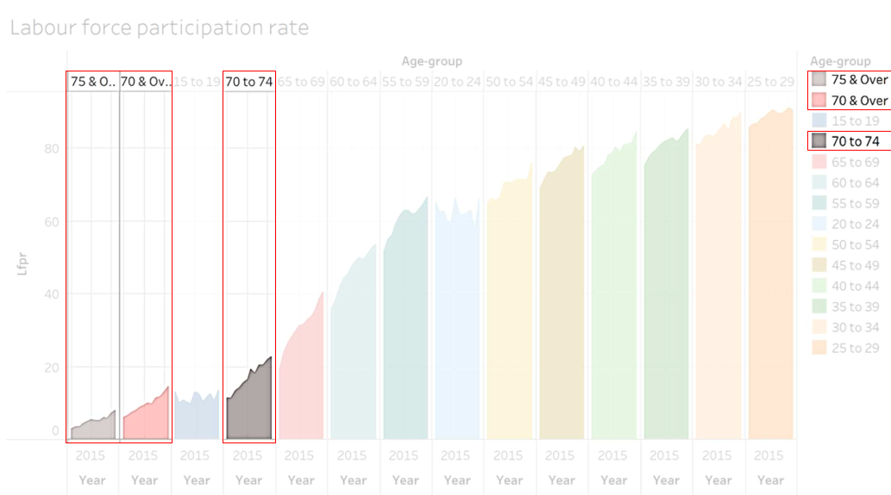

```{r setup, include=FALSE}
knitr::opts_chunk$set(echo = FALSE)
```

```{css, echo = FALSE}
d-article p {
  text-align: justify;
}
```

# 1   Introduction

This data makeover is based on the data provided by the Ministry of Manpower, Singapore (MOM). The data is available on the [MOM website](https://stats.mom.gov.sg/Pages/LabourForceTimeSeries.aspx) in .xlsx (Microsoft Excel) format and is titled **"Resident Labour Force Participation Rate by Age and Sex"**.

For a simple definition, the Labour Force Participation Rate (LFPR) of an economy is calculated as the labour force (working or looking for work, with minimum 15 years of age) divided by the total age population. It gives an indication of the magnitude of the supply of labour available for the production of goods and services in an economy. 

The data set by MOM comprises of 2 sheets, the first one with the ages banded into distinct categories *"15 to 24"*, *"25 to 54"*, *"25 to 64"*, *"55 to 64"* and *"65 & Over"*. The second sheet comprises of age bands in increment of 5 years, from *"15 to 19"* until *75 & Over*, and also provides the band *70 & Over*.

Both data sets consists of time series data from 1991 to 2021, with the exception of the years **1995**, **2000**, and **2005**. Each sheet consists of the Total LFPR, and also broken down into each gender for *Males* and *Females*.


# 2   Original Data Visualisation

The original data visualisation is shown below.

<center>


</center>

At first glance, the chart seems to be really beautiful, with a proper font, large array of colours, and even a simple title. However, on closer inspection, one cannot really tell what information is meant to be understood from the graph.

The image below is obtained from [Ben Jones](https://dataremixed.com/2012/05/clarity-or-aesthetics-part-2-a-tale-of-four-quadrants/), an author who occasionally write about data visualisation.

<center>


</center>

We can classify any data visualisation into any of these 4 quadrants, on a X scale of **Clarity** and a Y scale of **Aesthetics**. Personally, I would put this visualisation into Quadrant IV, as it is *Beautiful* but *Confusing*. We break down each of these to critique.

## 2.1    Aesthetics

Aesthetics refers to how the graph looks. Looking at the original visualisation, it looks interesting with the many colours.

<center>


</center>

However, there are a couple of points that needs to be critiqued.

### 2.1.1 Area graph is not an appriopriate tool for this

The area graph is a useful tool for time series data such as this but is usually used for a single time series or comparison between a few time series data. 

The area should emphasise the overall trend of the data over time. Since there are too many time series data in this chart, it is hard for the user to differentiate across the area charts and see which is the most important.

A line graph would be a better visualisation choice.

### 2.1.2 The axis and legend shows duplicated information

The axis at the top of the graph and the legend is repeated and does not provide any additional information. The labelling should just be present on **either** the main chart or the legend and not both, with no truncation such as **"75 & O.."** and **"70 & Ov.."**.

<center>


</center>


### 2.1.3 There are too many colours on the graph

Choice of colour plays a major factor in creating visually appealing charts. The colours should highlight the story that the creator wants the data to tell, and enhance the message. Colours are usually used for categorical data, 

For this chart, the colours are not meaningful and hence should be avoided. 

## 2.2    Clarity

The chart is also unclear on the following points.

### 2.2.1 The title does not convey any useful information

<center>


</center>

A chart is supposed to convey a message to the audience. However for this chart, the title, **"Labour Force participation rate"**, does not give any message to the reader. If the creator of the chart just wanted to show the LFPR, he could use a table just like the original data set that MOM provided. Anybody without prior knowledge would not know what Labour force participation rate means, and hence would not understand the chart.

### 2.2.2 Both axes are not labelled properly 

<center>


</center>


The y-axis mentions a single word **"Lfpr"**, it should be in full (Labour Force Participation Rate) instead of abbreviated. Unless the reader is familiar with this statistical measure from MOM, he or she will not know what it means. Hence, it is advised to use the full text in all labels unless it is an abbreviation universally well known, such as *EU* or *USA*.

Furthermore, y-axis does not show any units. LFPR should be in terms of *percentage* hence there should be a "%" either at each of the labels, or the axis title itself.

<center>


</center>


On the other hand, the x-axis only shows the year 2015. It can be seen from the chart that there is a line with area graph that varies along the x axis, hence it would most likely be showing the change in LFPR over time. To solve this issue, the creator should have either rotated the x-axis labels or combined the labels together, as the chart is not wide enough to show its axis labels.

### 2.2.3 The age groups are not sorted in order

<center>


</center>

Age Groups are sorted from least LFPR to highest LFPR, and hence there is no sense of consistency: *"70 & over"* transitions to *"15 to 19"*, and the last category is *"25 to 29"*. 

The graph should have be arranged according to Age Groups instead, either ascending or descending age - *"15 to 19"* could have been first and *"75 & Over"* last.

Additionally, there are overlapping age groups due to the way the raw data is structured. *"70 & Over"* consists of both *"70 to 74" and "75 & Over"* but both are plotted on the same graph. They should be separated, either by only plotting *70 & Over*, **or** plotting *70 to 74 with 75 & Over*.

<center>



</center>

# 3    Proposed Design

## 3.1 Sketch of Design

## 3.2 Advantages of Design

The proposed design addresses the following issues mentioned above:

1. *Area graph should not be used*

**Line graphs** will be used to depict the time-series nature of the graph, to show a comparison between the start and the end values of the data set.

2. *The axis and legend shows duplicated information*

The chart will directly show each of the age groups, with a legend denoting the shade of colour corresponding to the **change in LFPR**.

3. *There are too many colours on the graph*

The graph will show **two** distinct colours with separate **hues**, to denote an increase or decrease in LFPR over time.

4. *The Title does not convey any useful information*

The key message of the chart will be conveyed, to the point. It will state the **purpose** of the chart to allow the reader to know what to look out for in the chart.

5. *Both axes are not labelled properly*

The chart will have the same y-axis but with proper units (%) and labels. For the x-axis, the time series will show the whole range of data, and with labels **every 5 years**.

6. *The age groups are not sorted in order*

Since line graphs are used for the chart, the age groups will be labelled properly. A **secondary graph** will also show the distinct working age groups that are used for comparison.

## 3.3 Proposed Visualisation on Tableau

Please view the proposed visualisation on [**Tableau Public**]().

#   4 Building the Visualisation


<table>
<tr>
  <th>No</th>
  <th>Step</th>
  <th>Action</th>
</tr>

<tr style="height:50px">
  <td>1</td>
  <td>Unzip the output folder downloaded from the SingStat website. Load the outputFile excel file into Tableau Prep Builder. Drag the ‘T1’ and ‘T2’ worksheet into main pane.</td>
  <td></td>
</tr>

<tr>
  <td>2</td>
  <td>Unzip the output folder downloaded from the SingStat website. Load the outputFile excel file into Tableau Prep Builder. Drag the ‘T1’ and ‘T2’ worksheet into main pane.</td>
  <td></td>
</tr>

<tr>
  <td>3</td>
  <td>Unzip the output folder downloaded from the SingStat website. Load the outputFile excel file into Tableau Prep Builder. Drag the ‘T1’ and ‘T2’ worksheet into main pane.</td>
  <td></td>
</tr>

<tr>
  <td>4</td>
  <td>Unzip the output folder downloaded from the SingStat website. Load the outputFile excel file into Tableau Prep Builder. Drag the ‘T1’ and ‘T2’ worksheet into main pane.</td>
  <td></td>
</tr>

<tr>
  <td>5</td>
  <td>Unzip the output folder downloaded from the SingStat website. Load the outputFile excel file into Tableau Prep Builder. Drag the ‘T1’ and ‘T2’ worksheet into main pane.</td>
  <td></td>
</tr>

<tr>
  <td>6</td>
  <td>Unzip the output folder downloaded from the SingStat website. Load the outputFile excel file into Tableau Prep Builder. Drag the ‘T1’ and ‘T2’ worksheet into main pane.</td>
  <td></td>
</tr>

<tr>
  <td>7</td>
  <td>Unzip the output folder downloaded from the SingStat website. Load the outputFile excel file into Tableau Prep Builder. Drag the ‘T1’ and ‘T2’ worksheet into main pane.</td>
  <td></td>
</tr>

<tr>
  <td>8</td>
  <td>Unzip the output folder downloaded from the SingStat website. Load the outputFile excel file into Tableau Prep Builder. Drag the ‘T1’ and ‘T2’ worksheet into main pane.</td>
  <td></td>
</tr>

<tr>
  <td>9</td>
  <td>Unzip the output folder downloaded from the SingStat website. Load the outputFile excel file into Tableau Prep Builder. Drag the ‘T1’ and ‘T2’ worksheet into main pane.</td>
  <td></td>
</tr>

<tr>
  <td>10</td>
  <td>Unzip the output folder downloaded from the SingStat website. Load the outputFile excel file into Tableau Prep Builder. Drag the ‘T1’ and ‘T2’ worksheet into main pane.</td>
  <td></td>
</tr>

<tr>
  <td>11</td>
  <td>Unzip the output folder downloaded from the SingStat website. Load the outputFile excel file into Tableau Prep Builder. Drag the ‘T1’ and ‘T2’ worksheet into main pane.</td>
  <td></td>
</tr>

<tr>
  <td>12</td>
  <td>Unzip the output folder downloaded from the SingStat website. Load the outputFile excel file into Tableau Prep Builder. Drag the ‘T1’ and ‘T2’ worksheet into main pane.</td>
  <td></td>
</tr>

<tr>
  <td>13</td>
  <td>Unzip the output folder downloaded from the SingStat website. Load the outputFile excel file into Tableau Prep Builder. Drag the ‘T1’ and ‘T2’ worksheet into main pane.</td>
  <td></td>
</tr>

<tr>
  <td>14</td>
  <td>Unzip the output folder downloaded from the SingStat website. Load the outputFile excel file into Tableau Prep Builder. Drag the ‘T1’ and ‘T2’ worksheet into main pane.</td>
  <td></td>
</tr>

<tr>
  <td>15</td>
  <td>Unzip the output folder downloaded from the SingStat website. Load the outputFile excel file into Tableau Prep Builder. Drag the ‘T1’ and ‘T2’ worksheet into main pane.</td>
  <td></td>
</tr>

<tr>
  <td>16</td>
  <td>Unzip the output folder downloaded from the SingStat website. Load the outputFile excel file into Tableau Prep Builder. Drag the ‘T1’ and ‘T2’ worksheet into main pane.</td>
  <td></td>
</tr>

</table>


# 5   Concluding Remarks

