```{r setup, include=FALSE}
knitr::opts_chunk$set(echo = TRUE)
```

# Overview

There are many data visualisation programmes (and languages) out in the market, and the two of the more popular ones, namely Tableau and R, will be compared, with a walkthrough on how to plot charts in R.

R has both data wrangling and visualisation, and has more advanced tools to provide customisability if needed. Tableau Desktop can plot charts simply if the data is clean and organised, and will produce beautiful charts as shown below. 

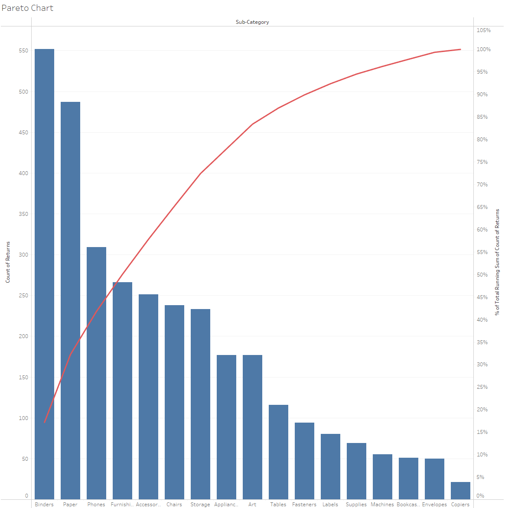
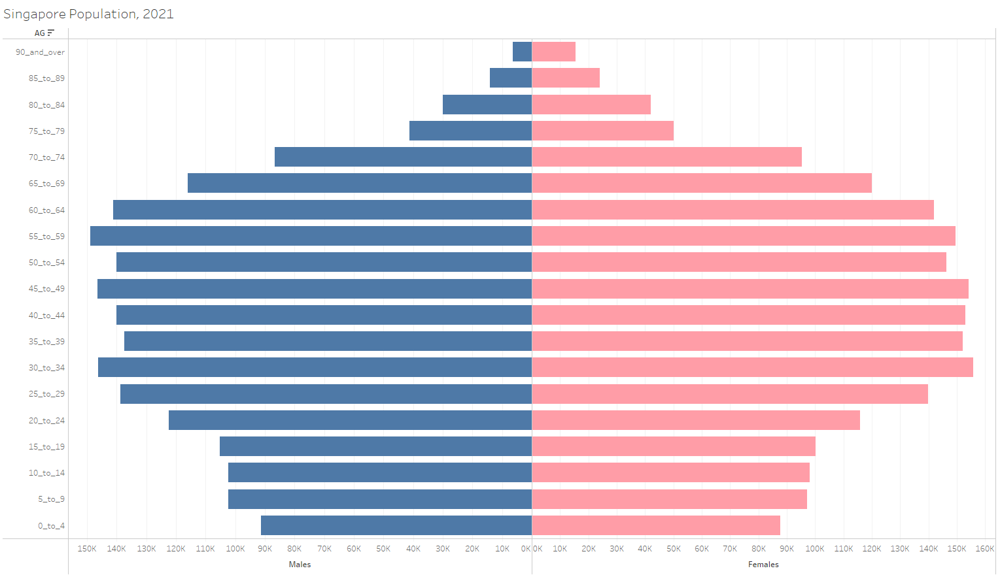

However, in this task, we will focus more on R and how to manipulate data, and plot charts with it.

## Sketch of Design

Essential planning is a must in data visualisation. Often the analyst has to decide what to show on the chart, and what is the best or most efficient way to produce it. We will attempt to plot a Pareto Chart and a Population Pyramid like in Tableau, and a sketch below shows the initial planning phase.

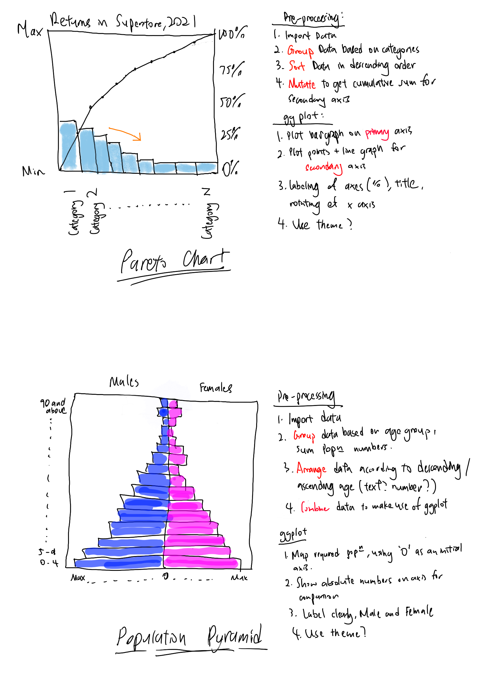

## Using Visualisation Tools in R

The [tidyverse](https://www.tidyverse.org/) is a collection of open source R packages designed for data science.


The core packages namely [ggplot2](https://ggplot2.tidyverse.org/), [dplyr](https://dplyr.tidyverse.org/), [tidyr](https://tidyr.tidyverse.org/), [readr](https://readr.tidyverse.org/), [purrr](https://purrr.tidyverse.org/), [tibble](https://tibble.tidyverse.org/), [stringr](https://stringr.tidyverse.org/) and [forcats](https://forcats.tidyverse.org/) provide functionality to read, model, transform and visualise data. There are also specialised packages such as [readxl](https://readxl.tidyverse.org/) that can be attached by the analyst for more specific functionality as and when needed.

[ggplot2](https://ggplot2.tidyverse.org/) is the core visualisation package in R that can help to elevate data visualisation. It breaks up data visualisation into several layers using [The Grammar of Graphics](https://books.google.com.sg/books/about/The_Grammar_of_Graphics.html?id=ZiwLCAAAQBAJ&source=kp_book_description&redir_esc=y), such as Data, Geometries, Statistics and Themes. 

In this article, we go through two different ways ggplot can be used to tell compelling stories using data, in the form of a [Pareto Chart](https://asq.org/quality-resources/pareto#:~:text=A%20Pareto%20chart%20is%20a,which%20situations%20are%20more%20significant.) and a [Population Pyramid](https://www.nationalgeographic.org/encyclopedia/population-pyramid/).

## Pareto Chart

Pareto chart is a type of chart that consists of a bar and line graph, where individual values are represented in descending order by bars, and the cumulative total is represented using the line. The chart is named after the Pareto Principle, which states that roughly 80% of consequences come from 20% of the causes. 

This is important in business settings, as it can help companies to identify and not be over-reliant on only a handful of sources that make up a majority of their profits and sales. 

The chart is also widely used in quality control, where it is said that 80% of the failures are coming from 20% of the causes. Pareto charts are hence useful to find the defects to prioritise and rectify to have the greatest improvement.

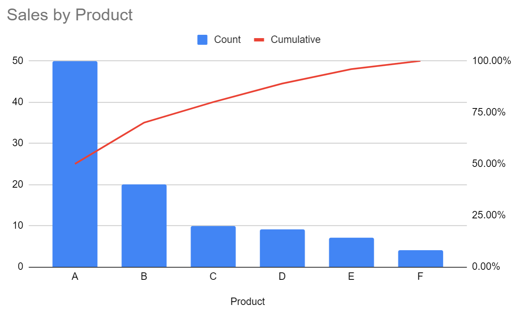

A pareto chart consists of a single x-axis and two y-axes, also known as a dual axis chart. The x-axis represents the *observations*. The left y-axis (primary y-axis) shows the **absolute frequency** of the observations and are represented as bars on the chart. The right y-axis (secondary y-axis) shows the **cumulative relative frequency** (in terms of percent of total) of the observations and are presented by scatter plot with dots. 

# Getting Started

In this exercise, we are going to create a pareto chart showing the distribution of returns by sub-category by using a data set from a retail store group. This will help the retail store understand which type of their products are most likely to be returned, and hence take action to correct it if necessary. 

### Installing and loading the required libraries

The code chunk below is used to check if the necessary R packages are installed in R, and if not, they will be. If they are already installed, they will be launched in the R environment.

```{r}
packages = c('tidyverse', 'readxl', 'knitr','lemon')

for (p in packages){
  if(!require(p, character.only = T)){
    install.packages(p)
  }
  library(p, character.only = T)
}
```

As mentioned, the **readxl** and **knitr** packages is not part of the core *tidyverse* package and has to be listed separately.
The [*lemon*](https://cran.r-project.org/web/packages/lemon/index.html) package helps to further customise the legends and axes and acts as a supplement to *ggplot2*.

### Data Import

In this exercise, superstore-2021 data set will be used in this example. It is an Excel file, and consists of three worksheets: Orders, People and Returns. As the data is provided in .xls format, the *superstore-2021.xls* will be imported into the R environment by using the [*read_xls*](https://readxl.tidyverse.org/reference/read_excel.html) function of the **readxl** package we have loaded earlier.

```{r}
orders <- read_xls("data/Superstore-2021.xls",
                   sheet = "Orders")
returns <- read_xls("data/Superstore-2021.xls",
                    sheet = "Returns")
```

This should load up 2 [tibble](https://tibble.tidyverse.org/reference/tibble-package.html) data frames in Rstudio and it is a good practice to check the Environment tab that the Data is loaded in.

The images below show the 2 data frames loaded into the R environment.


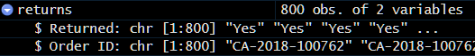


## Data Wrangling

### Joining the two data frames
In this stage, the [*left_join*](https://dplyr.tidyverse.org/reference/mutate-joins.html) of **dplyr** is used to combine the orders and returns data frames by using the Order ID as the common and unique identifier. This will help us subset the data of the orders that have been returned.

```{r}
joined_tab <- left_join(returns, orders,
                        by = c('Order ID' = 'Order ID'))
```

### Compute the frequency count by Sub-Category

Next, we are going to compute the frequency of returns by sub-category. We are going to use the [*group-by*](https://dplyr.tidyverse.org/reference/group_by.html) method from the **dplyr** package to do this. In the code chunk below, the groupby method is used to group the orders by Sub-Category. Then the [summarise()](https://dplyr.tidyverse.org/reference/summarise.html) method of **dplyr** is used to count (i.e. [*n()*](https://dplyr.tidyverse.org/reference/context.html)) the number of returned orders.

```{r}
freq_returned <- joined_tab %>%
  group_by(`Sub-Category`) %>%
  summarise('Returns' = n()) %>%
  ungroup()
```

### Sorting data to get absolute frequency

By default, the values of the tibble data frame is sorted according to the values of the first column. In this case, the values are sorted alphabetically by the Sub-Category field as seen below.


The Pareto chart however, requires the data to be sorted in descending order of frequency, for us to visualise the 80-20 effect and to calculate the relative cumulative frequency. Hence, the [*arrange()*](https://dplyr.tidyverse.org/reference/arrange.html) of **dplyr** package is used as shown in the code chunk below. 

```{r}
freq_sorted <- freq_returned %>%
  arrange(desc(Returns))
```

The sorted data frame should now look like the one below:

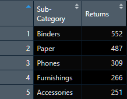

### Computing the cumulative frequency

We now have to calculate the cumulative frequency of returns by product sub-category. This task will be performed using the [*mutate()*](https://dplyr.tidyverse.org/reference/mutate.html) of dplyr package and [*cumsum()*](https://www.rdocumentation.org/packages/base/versions/3.6.2/topics/cumsum) of Base R.

```{r}
freq_cum <- freq_sorted %>%
  mutate(cumfreq = cumsum(Returns))
```

### Computing the relative cumulative frequency

We can then use this data to calculate the relative cumulative frequency (in %) of the returns by dividing the cumulative frequency by the total number of returns. We then add this as a column to the existing data frame.

```{r}
freq_cum$cumrel = freq_cum$cumfreq/max(freq_cum$cumfreq) * 100
```

The data frame is now complete and should look like the one below:

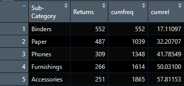


## Plotting the data

Now that we have the data we need for the Pareto chart, we can use the [ggplot2](https://ggplot2.tidyverse.org/) package to start data visualising. We do not have to install any further packages as this is included in the core tinyverse package!

As ggplot has an inbuilt [*sec_axis*](https://ggplot2.tidyverse.org/reference/sec_axis.html) function, we can use it to plot our secondary y-axis on the same chart. This however requires a one-to-one transformation and we have to calculate it based on the maximum value of the Returns column.

Also, since the secondary axis is showing the cumulative frequency of the returns, we have to add in units of '%'. This is shown in the code chunk below.

```{r}
coef <- max(freq_cum$Returns)/100

addPercent <- function(x, ...)
  format(paste0(x, "%"),...)
```

To ensure flexibility, the ggplot is assigned to a variable "p", so that we can set the theme later to make the plot more aesthetic. The plot can now be established with the code chunk below.

```{r}
p <- ggplot(freq_cum, aes(x=`Sub-Category`)) +
  geom_bar(aes(reorder(`Sub-Category`,-`Returns`),`Returns`), 
           fill="light blue",
           color="black",
           stat="identity") +
  geom_point(aes(y=`cumrel`*coef)) +
  geom_line(aes(reorder(`Sub-Category`,`cumrel`),y=`cumrel`*coef),
            color="black",
            group=1) +
  scale_y_continuous(
    name = "No. of Returns",
    sec.axis = sec_axis(~./coef, 
                        name = "Cumulative Frequency",
                        labels = addPercent)) +
  labs(title = "Number of Returns for Superstore, 2021")

p
```

The ggplot function looks slightly complicated, but we can break it down into smaller sections:


* Firstly, the ggplot function is called, using the data frame *freq_cum* with the x values of column *Sub-Category*
* [**geom_bar**](https://ggplot2.tidyverse.org/reference/geom_bar.html) to plot the *Returns* for each sub-category
    + **Reorder** is required to arrange the *Returns* from high to low,
    + Additional customisation such as fill colour, border colour are added
* [**geom_point**](https://ggplot2.tidyverse.org/reference/geom_point.html) plots the scatter points of the cumulative relative frequency
* Similarly, [**geom_line**](https://ggplot2.tidyverse.org/reference/geom_path.html?q=geom%20_%20line) connects the points together
    + **Reorder** is required to ensure that the line connects the points in order when **group=1** is applied to the function
    + The line is set as black for simplicity
* [**scale_y_continuous**](https://ggplot2.tidyverse.org/reference/scale_continuous.html) is used to define both y-axes
    + The name is used to define the primary y-axis
    + **sec.axis** is defined and calculated
    + As mentioned earlier, the secondary axis has to be scaled in relation to the primary axis, and this is where the defined *coef* is applied.
    + The name is added and the labels of % is added as defined in an earlier function
* Finally, the title is defined using **labs** to ensure the chart is clear.


Just a little more touchup to change the background colour and to add a border, along with rotating the x-labels to ensure everything is readable.

```{r}
p + theme(panel.background = element_rect(fill="white"),
          panel.border = element_rect(linetype=1, fill=NA),
          axis.text.x = element_text(angle=90))
```

## Population Pyramid

Population pyramid is a type of chart that consists of two horizontal bar diagrams placed side by side, separated along the middle. It typically takes the shape of a pyramid when the population is growing.

Assessing a population pyramid over time can determine the stage of [demographic transition](https://en.wikipedia.org/wiki/Demographic_transition), and overall age of distribution of a population. It can also tell us the [dependency ratio](https://en.wikipedia.org/wiki/Dependency_ratio) of a population, allowing policy makers to plan ahead.

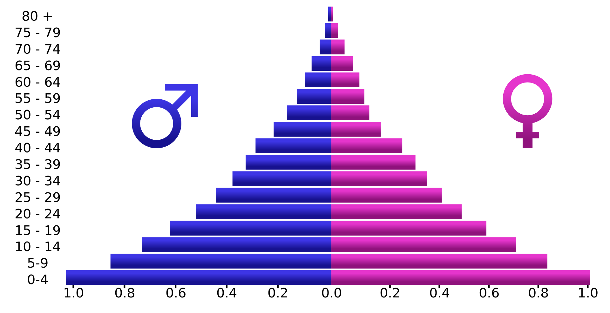

A population pyramid consists of a single x-axis and y-axis. The x-axis represents the *population size*, while the y-axis represents the *age groups*. Males are conventionally shown on the left and females on the right.

# Getting Started

In this exercise, we are going to create a population pyramid based on the demographics of Singapore. 

### Data Import

In this exercise, data from [singstat.gov.sg](singstat.gov.sg) is taken. Singstat is operated by the Singapore Department of Statistics, and contains insightful statistics used by various agencies, policymakers and analysts for planning and research.

For this population pyramid, we have to navigate to the [Population](https://www.singstat.gov.sg/find-data/search-by-theme/population/geographic-distribution/latest-data) page, and download the latest data from Population Trends [Singapore Residents, 2021](https://www.singstat.gov.sg/-/media/files/find_data/population/statistical_tables/respopagesextod2021.zip)

As the data is provided in csv, we have to use the [**read_csv**](https://readr.tidyverse.org/reference/read_delim.html) function which is already included in *tidyverse* to import data.


```{r}
popn <- read_csv('data/respopagesextod2021.csv')
```

This will load up 1 tibble data frame in Rstudio for us as seen below.
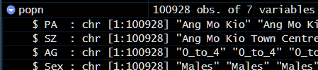

## Data Wrangling

### Consolidating the data frame

We are interested in the total population of each Age Group for each of the Sexes. Hence the [**filter**](https://dplyr.tidyverse.org/reference/filter.html), [**group_by**](https://dplyr.tidyverse.org/reference/group_by.html), [**summarise**](https://dplyr.tidyverse.org/reference/summarise.html) and [**mutate**](https://dplyr.tidyverse.org/reference/mutate.html) of *dplyr* are used.

Firstly, we **filter** the population tibble and assign them into Males and Females. We then **group** the tibbles by Age Group (AG), and **summarise** the statistic Population (Pop) by summing it. Next, to identify the data better, we add a column using the **mutate** function and ungroup to ensure that the data will not produce errors in future calculations. Always make sure to **ungroup** after using **group_by**! Lastly, the data is made neater when the underscores in the Age Groups are replaced with spaces.

```{r}
males <- popn %>% filter(Sex == 'Males')
females <- popn %>% filter(Sex == 'Females')
males_popn <- males %>%
  group_by(AG) %>%
  summarise(Population=sum(Pop)) %>%
  mutate(Sex="Male") %>%
  ungroup()
females_popn <- females %>%
  group_by(AG) %>%
  summarise(Population=sum(Pop)) %>%
  mutate(Sex="Female") %>%
  ungroup()

males_popn$AG <- gsub("_"," ", males_popn$AG)
females_popn$AG <- gsub("_"," ",females_popn$AG)
```

### Assigning the order of plotting in Age Group

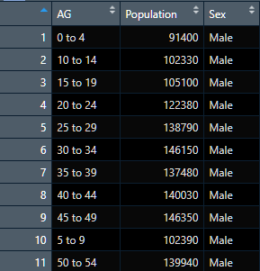

If we take a look at the data, we can see that the first row is **0_to_4**, and then it skips **5_to_9** and jumps straight to **10_to_14**. The **5_to_9** is instead in the 10th row of the data frame. R automatically sorts based on alphabetical order, and hence we have to reorder it using the code chunk below.

```{r}
ageorder <- c("0 to 4","5 to 9","10 to 14","15 to 19",
             "20 to 24","25 to 29","30 to 34","35 to 39",
             "40 to 44","45 to 49","50 to 54","55 to 59",
             "60 to 64","65 to 69","70 to 74","75 to 79",
             "80 to 84","85 to 89","90 and over")

males_popn_sort <- males_popn %>%
  slice(match(ageorder, AG))
females_popn_sort <- females_popn %>%
  slice(match(ageorder, AG))
```

We first assign a vector that we want the order to be in, from 0 to 90 and over. Then, the AG column is matched with the vector to produce the same order and will look something like this:

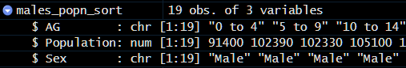

However, the AG column is in **chr** form and will be automatically reordered when using ggplot. We have to assign a [**factor**](https://www.rdocumentation.org/packages/base/versions/3.6.2/topics/factor) using the vector earlier to fix the order.

```{r}
males_popn_sort$AG <- factor(males_popn_sort$AG, levels=ageorder)
females_popn_sort$AG <- factor(females_popn_sort$AG, levels=ageorder)
```

The data frame should look something like this:

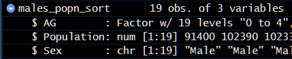

### Combining the data frame

We then combine the two data frames together in preparation for plotting using the [**bind_rows**](https://dplyr.tidyverse.org/reference/bind.html) function of *dplyr*.

```{r}
total_popn <- bind_rows(males_popn_sort, females_popn_sort)
```

We should now check whether we have what we need, a table of all the populations for the pyramid, and whether it is in the correct order.

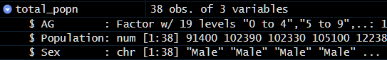

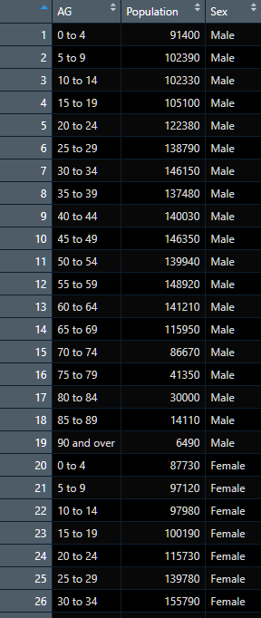

## Plotting the data

```{r}
p2 <- ggplot(data = total_popn,
       mapping = aes(
         x=ifelse(test = Sex=="Male", yes=-Population, no=Population), 
         y=AG, 
         fill=Sex)) +
  geom_col() +
  labs(x="Population") +
  labs(y="Age Groups") +
  labs(title = "Population of Singapore, 2021") +
  scale_x_symmetric(labels=abs)

p2
```

Like before, lets break it down into smaller sections:


* The ggplot function is called, using the data frame *total_popn* with the y values of column *AG*
* The x values are dependent on the Sex values of each row, using an ifelse statement
    + If the row contains Sex="Male", -(Population) will be used
    + else, the row contains Sex="Female" and Population will be used
    + This ensures that Males are plotted to the left of the center axis and Females to the right.
* [**geom_col**](https://ggplot2.tidyverse.org/reference/geom_bar.html) is used to plot the data and to ensure that we do not have to flip any axis.
* Labels are then added, for both axes and the title.
* Lastly, the [**scale_x_symmetric**](https://www.rdocumentation.org/packages/lemon/versions/0.4.5/topics/scale_x_symmetric) of *lemon* is used to ensure that the x axis is symmetrical, and there are no negative values


As usual, we touchup to change the background colour and to add a slight border to the graph.


```{r}
p2 + theme(panel.background = element_rect(fill="white"),
          panel.border = element_rect(linetype=1, fill=NA))
```

There you have it! A Pareto Chart and Population Pyramid plotted using R with the help of useful libraries.

## Conclusion

### There are a couple of advantages R has over Tableau. 

Firstly, R is free. It is an open source software environment, and hence is available for everyone to check and scrutinise its code. There is also a large network of R users, and a myriad of libraries for R users to use.

Web scraping, data wrangling and processing, and data visualisation can all be performed in R as compared to Tableau.

For data wrangling and processing, tidyverse is a very useful package to have. We can easily adjust the data for our graphs, and even come up with new insights while processing the data. Compare this to Tableau Desktop where it is less versatile in combining data frames, joining them or even manipulating the data itself.

For data visualisation, we have ggplot in R. ggplot builds on the basic building blocks of a chart and is very customisable according to what the user wants to show. Tableau desktop can generate most common plots very quickly, but is less customisable. It is hence more advisable for quick and easy plots where data processing may not be required.

Lastly, R is reproducible and repeatable. Like this article, everything can be reproducible in code form, from data wrangling to visualisation. Compare this to Tableau where the steps are not easily traced, and hence might not be as reproducible. This is important as data analysts as it is a good practice to keep everything on record when there is a need to revisit the data.

### There are some drawbacks to R as well.

R requires a lot of time and patience to learn. Without learning the building blocks of R, it is very hard for a user to understand the internal R processing and why some things turn out differently from what one might expect. Fortunately, there are many tutorials and guides to learn about R.

It takes more effort in R to produce interactive charts as compared to Tableau. Additional coding and learning is required and modules such as R Shiny have to be used. 

It is very hard to produce charts en masse in R. Every plot requires a specific list of inputs depending on what the chart needs, as they are all different building blocks. Tableau allows for quick customisation as it is very convenient to generate different types of plots in a few clicks. This helps the user to quickly ascertain what is the best plot for the dataset, as compared to R where the user has to plan and likely know beforehand what he is going to produce.

Each program has it own benefits and disadvantages, and can be interchangeable depending on the user's needs. For basic charts and complete datasets, Tableau will serve its purpose very well but if data wrangling and customisation is required, R will definitely be the better option.