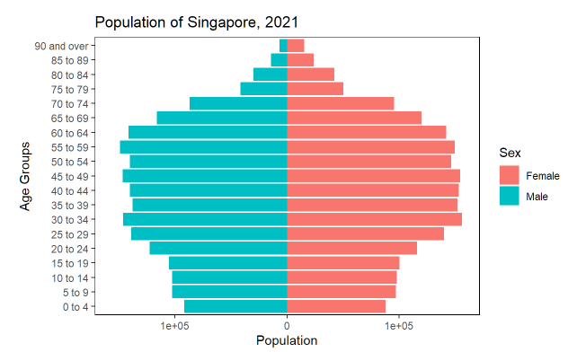
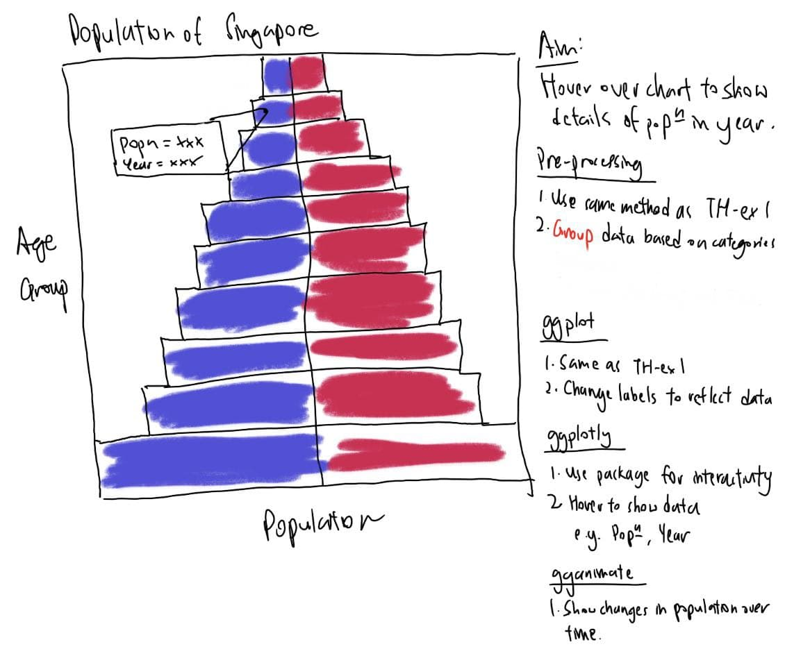
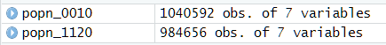
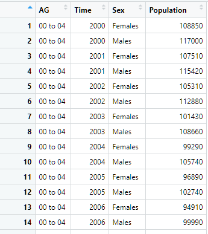

```{r setup, include=FALSE}
knitr::opts_chunk$set(echo = TRUE)
```

# Overview

Interactive charts can help to tell stories more effectively, by allowing the viewer to interact and do experiential learning. It helps the user to engage intellectually, take initiative and make their own visualisations based on their understanding and curiousity. A single static chart at best shows answers to a few questions, but users might want to develop specific insights or go deeper into the data to understand relationships between the data which cannot be achieved in a single chart.

We have done a static chart in the previous [Take-home Exercise 1](https://hengguang-608.netlify.app/takehome_exercise/ex001/ex001), where we went through the process of data import, data wrangling, combining, plotting the data, and refining the chart further using themes, and we produced a final output as shown below:


The above chart, while simple, does not give us a lot of information.

Firstly, it does not give us context. The chart only shows the Population of Singapore in 2021, but we do not know how the shape of the population pyramid has changed over the years. As mentioned previously, assessing a population pyramid over time can determine the stage of [demographic transition](https://en.wikipedia.org/wiki/Demographic_transition)

It also does not provide a detailed breakdown of the data. The data obtained from the [Department of Statistics, Singapore](https://www.singstat.gov.sg/), breaks down the data into Residents by Planning Area/Subzone, Age Group, Sex and Type of Dwelling. For a static chart, we can only show a combined version of the data and hence grouped everything and show the Age Group and Sex distributions.

# Getting Started

In this exercise, we will create an one interactive chart allowing the user see the detailed population data from years 2000-2020, and an animated chart to show the changes in population distribution over time.

### Sketch of Design

First, we plan what we want to show on the graph. This allows us to know what output we want to achieve, and hence what data we need, how to wrangle the data and plot the graph. 




### Loading the required libraries

The code chunk below is used to check if the necessary R packages are installed in R, and if not, they will be. If they are already installed, they will be launched in the R environment.

```{r}
packages = c('tidyverse', 'knitr', 'lemon',
             'plotly', 'gganimate')

for (p in packages){
  if(!require(p, character.only = T)){
    install.packages(p)
  }
  library(p, character.only = T)
}
```

The **knitr** package is not part of the core *tidyverse* package and has to be listed separately.
The [*lemon*](https://cran.r-project.org/web/packages/lemon/index.html) package helps to further customise the legends and axes and acts as a supplement to *ggplot2*. 

### Data Import

Like the previous exercise, the Population Data from [Department of Statistics, Singapore](https://www.singstat.gov.sg/) is obtained. 

We will navigate to the [Population](https://www.singstat.gov.sg/find-data/search-by-theme/population/geographic-distribution/latest-data) page and download both the *Singapore Residents by Planning Area / Subzone, Age Group, Sex and Type of Dwelling, June 2000-2010* and *Singapore Residents by Planning Area / Subzone, Age Group, Sex and Type of Dwelling, June 2011-2020* datasets.

As the data is provided in csv, we have to use the [**read_csv**](https://readr.tidyverse.org/reference/read_delim.html) function which is already included in *tidyverse* to import data.

```{r}
popn_0010 <- read_csv('data/respopagesextod2000to2010.csv')
popn_1120 <- read_csv('data/respopagesextod2011to2020.csv')
```

We now have 2 tibbles loaded into the Environment as shown.



## Data Wrangling

We are interested in the total population of each Age Group for each of the Sexes for each Planning Area. Hence the [**filter**](https://dplyr.tidyverse.org/reference/filter.html), [**group_by**](https://dplyr.tidyverse.org/reference/group_by.html), [**summarise**](https://dplyr.tidyverse.org/reference/summarise.html) and [**mutate**](https://dplyr.tidyverse.org/reference/mutate.html) of *dplyr* are used.

```{r}
options(scipen=999)

popn <- bind_rows(popn_0010, popn_1120)

total_popn <- popn %>%
  group_by(AG,Time, Sex, PA) %>%
  summarise(Population=sum(Pop)) %>%
  ungroup()

total_popn$AG <- gsub("_"," ", total_popn$AG)
total_popn$AG <- gsub("\\<0 to 4\\>","00 to 04", total_popn$AG)
total_popn$AG <- gsub("\\<5 to 9\\>","05 to 09",total_popn$AG)
```

The **option(scipen=999)** is set to ensure that scientific notation will not be used in the charts.

Firstly, we combine both tibbles together using the **bind_rows** function. 

We then **group** the tibbles by Age Group (AG), Time, and Sex, and **summarise** the statistic Population (Pop) by summing it. We then **ungroup** it to ensure that the data will not produce errors in future calculations. 

Lastly, the data is made neater when the underscores in the Age Groups are replaced with spaces. We also replace the 0 to 4 and 5 to 9 age groups to ensure that they are sorted when plotting.

This will give us a tibble as seen below.



## Interactive Chart

We can now create a basic interactive chart that shows the population of Males/Females in Singapore in selected planning areas and years based on the age groups.

### Plotting the Data

We can define a **function** that takes in the desired *Planning Area* and *Years.* Based on these parameters, the data frame will be **filtered** using the user's input. Then, we assign a tooltip to what we want to show on text hover, in this case we want to show the *Population* of an *Age Group* in a specific *Year.*

We then use the same code as in [Take-home Exercise 1](https://hengguang-608.netlify.app/takehome_exercise/ex001/ex001), while changing the **Title** and **Subtitle** to ensure clarity. We also add a **label = name** in the mapping to show the tooltip later. Since the data set consists of planning areas and years, we can use a [**facet_grid**](https://ggplot2.tidyverse.org/reference/facet_grid.html) to plot the various Planning Areas and Years.

Lastly, we pass through the figure through [**ggplotly**](https://plotly.com/ggplot2/facet_grid/) to make the chart interactive and to display the tooltip on hover. As this is a function, we have to return the plot using the **return** command.


```{r}
facetplot <- function(pa_selected, year_selected) {

total_popn_filtered <- total_popn %>%
  filter(PA %in% pa_selected & 
           Time %in% year_selected)

name <- paste0("\n", total_popn_filtered$Sex, 
               " Population of Ages ", total_popn_filtered$AG,
                      "\nin the Year ", total_popn_filtered$Time, 
                      "\n= ", total_popn_filtered$Population)
  
p <- ggplot(data = total_popn_filtered,
       mapping = aes(
         x=ifelse(test = Sex=="Males", yes=-Population,
                  no=Population), 
         y=AG, 
         fill=Sex,
         label=name)) + 
        geom_col() +
        theme(panel.background = element_rect(fill="white"),
              panel.border = element_rect(linetype=1, fill=NA),
              panel.spacing = unit(0.5, "lines")) +
        labs(x="Population") +
        labs(y="Age Groups") +
        labs(title = "Population of Singapore") +
        scale_x_symmetric(labels=abs)

p <- p + facet_grid(PA ~ Time)

fig <- ggplotly(p, tooltip = c("label"))

return(fig)
}
```

We can then define some arguments for comparison. In this example, I have provided 4 planning areas ("Bedok","Jurong East", "Ang Mo Kio", "Punggol") and 5 different years ("2000", "2005", "2010", "2015", "2020") to be plotted. The function can take in any amount of arguments, but the user is advised to pass in small sets of arguments at a time to appreciate the differences in plots!

```{r, layout = "l-screen-inset", fig.width=6, fig.height = 8}
facetplot(c("Bedok","Jurong East", "Ang Mo Kio", "Punggol"),
          c("2000", "2005", "2010", "2015", "2020"))
```
As this is a Distill article, we also pass through the layout argument [**l-screen-inset**](https://rstudio.github.io/distill/figures.html) to make use of the full width that Distill articles do not usually have.

## Animated Chart

We can also plot an animated chart to show the changes in the population pyramid structure over time. 

### Plotting the data

We can make use of the earlier ggplot object, **p**, and change the labels including the x-axis, Title and remove the subtitle to prepare for our animated plot with the code chunk below. 

```{r}
pp <- ggplot(data = total_popn,
       mapping = aes(
         x=ifelse(test = Sex=="Males", yes=-Population,
                  no=Population), 
         y=AG, 
         fill=Sex)) + 
  theme(panel.background = element_rect(fill="white"),
        panel.border = element_rect(linetype=1, fill=NA)) +
  geom_col() +
  labs(x="Population") +
  labs(y="Age Groups") +
  labs(title = "Population of Singapore",
       subtitle = "Aggregated, 2000-2020") +
  scale_x_symmetric(labels=abs)

pp
```

We use a parameter **frame_time** as an input to show the year when we animate it later.

```{r}
pp2 <- pp +
  labs(x="Population") +
  labs(title = "Population of Singapore, 
       {as.integer(frame_time)}", subtitle = NULL)

pp2
```

Do not worry about the population values as they will be sub-divided using the **Time** column.

Lastly, we will use the **transition_time** and **ease_aes** functions of the [*gganimate*](https://cran.r-project.org/web/packages/gganimate/gganimate.pdf) package to show how the data changes over time, and pass the **Time** column (which shows the years) as an animation. We also add a **start_pause** and **end_pause** to show the end state longer. The result is shown below.

```{r}
ppanim <- pp2 +
  transition_time(Time) +
  ease_aes('linear') 
  
animate(ppanim, start_pause=20, end_pause = 20, fps=20)
```

## Conclusion

With these plots, we can see how the charts have become more interactive and animated, to show the user a clearer picture of the data and to allow the user to pinpoint what data he/she wants to find out.

### Intepretation of results

For example, for the animated population pyramid, the policy-makers can see the changes in the population shape over time, and implement policies according to the changes based on the [population structure](http://wwjmrd.com/upload/types-and-significance-of-population-pyramids_1523552342.pdf).

We can see that the population is aging over time, with the base of the pyramid becoming smaller over time. This shows that either the fertility rate in Singapore is decreasing, or the mortality rates of young people in Singapore is increasing. Since we have local context, we know that the former is true and not the latter.

Next, we can see that the tip of the pyramid is expanding. This shows that there is a larger elderly population and that a higher age expectancy in Singapore. This could be due to a better healthcare system and elderly-care facilities.

### Possibilities of extension

The exercise can be further extended of course, with the use of variable inputs and outputs, such as using [R Shiny](https://shiny.rstudio.com/) and [Dash from Plotly](https://dash.plotly.com/r). These two packages allow the user to customise what inputs they need, such as the Planning Area, Subzone, Age Groups, and visualise in the form of various outputs. 