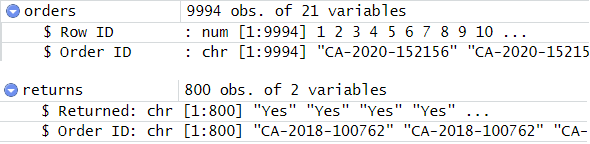

```{r setup, include=FALSE}
knitr::opts_chunk$set(echo = TRUE)
```

# Overview

In this exercise, we will use the techniques we have learnt to visualise data to provide an unbiased comparison of **orders returned by State** in the Superstore dataset, a commonly used dataset for data analysis practice. 

The superstore dataset consists of three tabs, namely Orders, People, and Returns. For the visualisation, we will only make use of the Orders and Returns tab, which will be explained below.

# Getting Started

In this exercise, we will create one Funnel Plot showing the Returns and Total Orders by State, and a Choropleth map to have an overall idea on the distributions by state. We also present a Data Table for the data to be explored. 

Hence, we will not need the People tab as it shows the manager of each region which is not necessary for our visualisation.


## Sketch of Design

First, we plan what we want to show on the graph. This allows us to know what output we want to achieve, and hence what data we need, how to wrangle the data and plot the graph. 


# Funnel Plot

A [*Funnel Plot*](https://www.sciencedirect.com/topics/medicine-and-dentistry/funnel-plot) is a specially designed data visualisation to conduct unbiased comparisons between entities against some measure of precision. The standard error is often chosen as the measure method, along with set confidence intervals along the mean to see what if there are any outliers that need remediation.

## Loading the required libraries

The code chunk below is used to check if the necessary R packages are installed in R, and if not, they will be. If they are already installed, they will be launched in the R environment.

```{r}
options(scipen=999)
packages = c('tidyverse', 'knitr', 'readxl', 'leaflet', 'plotly', 'ggplot2', 'DT','rjson')

for (p in packages){
  if(!require(p, character.only = T)){
    install.packages(p)
  }
  library(p, character.only = T)
}
```

The **knitr** and **readxl** package is not part of the core *tidyverse* package and has to be listed separately. The **leaflet** will be used to plot the map, while the **rjson** package helps to read the geojson files which lists the coordinates of the boundaries of the states. **Plotly**, **ggplot2** are used to plot and animate the graphs, while **DT** helps to present an interactive Data Table.

## Data Import

As the data is provided in xls (excel) format, we have to use the [*read_xl*](https://readxl.tidyverse.org/) function. We will import two of the three sheets, *Orders* and *Returns*.

```{r}
orders <- read_xls("data/Superstore-2021.xls",
                   sheet = "Orders")
returns <- read_xls("data/Superstore-2021.xls",
                    sheet = "Returns")
```

We now have two tibbles loaded into the Environment as shown.


From the image above, we can see that both the orders and returns contain a column named **Order ID**. The returns sheet is therefore a subset of all the items from the orders, as it only considers all the orders that have been returned.

We can first inspect both tibbles using the head() function.

This is a preview of the orders sheet.


```{r, echo = TRUE}
head(orders)
```

This is a preview of the returns sheet.


```{r, echo = TRUE}
head(returns)
```


## Data Wrangling

From the top few rows, we can see that some of the Order ID is repeated. This could be due to a single order having a basket of unique item IDs, each occupying a row of data. Since we are only planning to analyse the orders and proportion of returns, we should find the unique Order IDs and subset it.


```{r}
orders_u <- orders %>% 
  distinct(`Order ID`, .keep_all = TRUE)
returns_u <- returns %>% 
  distinct(`Order ID`, .keep_all = TRUE)
```

To combine the orders and the returns sheets, we have to use the [*join*](https://dplyr.tidyverse.org/reference/mutate-joins.html) function of **dplyr**. In this case, we an apply a *right* join to add the **Returns** onto the **orders_u** tibble. 

We will replace the "*Yes*" in the returns tab with *1*. Since the rest of the values will be "*NA*", we will have to replace *NA* with "*0*" using the [*replace_na*](https://tidyr.tidyverse.org/reference/replace_na.html) function from **tidyr**. Lastly, we check if the Returned tab in the data frame is what we expect.

```{r}
joined_tab <- right_join(returns_u, orders_u)
joined_tab$Returned <- replace(joined_tab$Returned, joined_tab$Returned == "Yes", 1)
joined_tab$Returned <- replace_na(joined_tab$Returned, 0)
joined_tab$Returned <- as.integer(joined_tab$Returned)
```

In building a funnel plot, we want to compress the data by State, and then find out the proportion of returns by state. We need the total number of orders and the total number of returns, along with the States.

First, we can find the total number of returns per state using the [*mutate()*](https://dplyr.tidyverse.org/reference/mutate.html) function of **dplyr**.


```{r}
states_returns <- joined_tab %>%
  group_by(`State`) %>%
  summarise(Returned = sum(Returned))
```

We can use the [*count()*](https://dplyr.tidyverse.org/reference/count.html) function of tidyr to get the total number of returns by state, and then rename the column.

```{r}
states_total <- count(joined_tab, State)
states_total <- rename(states_total, "Total" = "n")
```

We can use the join function again to aggregate the 2 data frames together.

```{r}
states_stats <- inner_join(states_returns, states_total, 
                           by = "State")
```

### Computing statistics for funnel plot

We can first calculate the proportion of the Returns for each state and calculate the standard error of the proportion using the code below.

```{r}
states_stats1 <- states_stats %>%
  mutate(rate = Returned / Total) %>%
  mutate(rate.se = sqrt((rate*(1-rate)) / (Total)))

states_stats <-  states_stats1 %>%
  filter(rate > 0)
```

We can then calculate the mean proportion of returns using the rates and their standard errors. We can also calculate the standard error of the sample mean.

```{r}
fit.mean <- weighted.mean(states_stats$rate, 1/states_stats$rate.se^2)

number.seq <- seq(1, max(states_stats$Total), 1)
fit.mean.se <- sqrt((fit.mean*(1-fit.mean)) / (number.seq)) 
```

We can construct the confidence intervals for the 95% and 99.9% values - this translates to Z values of 1.96 and 3.29 respectively.

```{r}

number.ll95 <- fit.mean - 1.96 * fit.mean.se
number.ul95 <- fit.mean + 1.96 * fit.mean.se
number.ll999 <- fit.mean - 3.29 * fit.mean.se
number.ul999 <- fit.mean + 3.29 * fit.mean.se
CI <- data.frame(number.ll95, number.ul95, number.ll999, number.ul999, number.seq, fit.mean)
```

### Plotting the Funnel Plot using ggplot

Since we have the Confidence Intervals of 95% and 99.9%, and the mean expected proportion, we can plot the graph using ggplot. The Returned rate and Total Number of Orders per *state* using scatter points, while the confidence intervals are plotted using lines: 95% using a dashed line and 99.9% using a solid line. We also use a reference horizontal line to plot the mean.

```{r, code_folding = FALSE}
p1 <- ggplot(states_stats, aes(x = Total, y = rate)) +
  geom_point(aes(label=`State`), 
             alpha=0.7) +
  geom_line(data = CI, 
            aes(x = number.seq, 
                y = number.ll95), 
            size = 0.4, 
            colour = "grey40", 
            linetype = "dashed") +
  geom_line(data = CI, 
            aes(x = number.seq, 
                y = number.ul95), 
            size = 0.4, 
            colour = "grey40", 
            linetype = "dashed") +
  geom_line(data = CI, 
            aes(x = number.seq, 
                y = number.ll999), 
            size = 0.4, 
            colour = "grey40") +
  geom_line(data = CI, 
            aes(x = number.seq, 
                y = number.ul999), 
            size = 0.4, 
            colour = "grey40") +
  geom_hline(data = CI, 
             aes(yintercept = fit.mean), 
             size = 0.4) +
  coord_cartesian(ylim=c(0,0.2)) + 
  annotate("text", x = 1200, y = 0.045, label = "Mean", size = 3) +
  annotate("text", x = 750, y = 0.032, label = "95%", size = 3) + 
  annotate("text", x = 750, y = 0.008, label = "99.9%", size = 3) +
  ggtitle("Total Orders and Proportion of Returns by US States") +
  xlab("Total Orders by State") + 
  ylab("Proportion of Returns of Orders") +
  theme_bw() +
  theme(plot.title = element_text(size=12))

p1
```

We pass in additional parameters to make the chart clearer, such as using grey colours for the lines to emphasise the scatter points, and to label the confidence intervals on the charts using the annotate() function. 

Lastly, we can use the plotly to make the chart interactive by passing the plot through it, along with the appropriate labels on hover.

```{r, code_folding = FALSE}
ggplotly(p1,
         tooltip = c("label", "x", "y"))
```


# Choropleth

A [*Choropleth Map*](https://datavizcatalogue.com/methods/choropleth.html) is a map where the areas are highlighted in proportion to a statistical variable. The hue progression indicates the intensity or magnitude of the variable, and can help to show variation over the region. 

## Loading the required libraries

For this map, we will need to import a json file. We will thus need the library rjson to be loaded in. The rest of the packages can be reused for this.

```{r}
packages = c()

for (p in packages){
  if(!require(p, character.only = T)){
    install.packages(p)
  }
  library(p, character.only = T)
}
```

### Data Wrangling

We can use the same data used for the funnel plot in the choropleth map, using the Rate and State columns. The Total and Returned data will also be included in the tooltip for completeness.

Firstly, we need to import the [GEOJSON](https://geojson.org/) data into "sp" objects, which allows us to assign properties after.

```{r}
statesgeo <- geojsonio::geojson_read("https://rstudio.github.io/leaflet/json/us-states.geojson", what = "sp")
```

We have to do a bit of manipulation here; the Superstore data consists of 49 states, while the geojson data consists of 52 US states and territories. Hence, we do a merge to preserve all of the data. 

```{r}
states_stats_geo <- states_stats1
states_stats_geo1 <- rename(states_stats_geo, "name" = State)
states_stats_geo2 <- merge(states_stats_geo1, statesgeo, by = "name", all.y = TRUE)
```

We then add additional columns from our funnel plot data to aid in labelling and plotting afterwards.

```{r}
statesgeo$rate <- states_stats_geo2$rate
statesgeo$Total <- states_stats_geo2$Total
statesgeo$Returned <- states_stats_geo2$Returned
```

### Using leaflet to extract json data

Next we use the [**leaflet**](https://leafletjs.com/) library to generate the polygons based on the json data. Leaflet maps are interactive, friendly and simple to construct. It has additional plugins and a well documented API.

```{r, code_folding = FALSE}
m <- leaflet(statesgeo) %>%
  setView(-96, 37.8, 4) %>%
  addProviderTiles("MapBox", options = providerTileOptions(
    id = "mapbox.light",
    accessToken = Sys.getenv('MAPBOX_ACCESS_TOKEN')))

m %>% addPolygons()
```

The code chunk above will produce all of the polygons available in the geojson file, without any customisation added.

### Customising the polygons on the map

We have to further customise the leaflet plot as shown in the code chunk below.

```{r, code_folding = FALSE}
bins <- c(0, 0.02, 0.04, 0.06, 0.08, 0.1, Inf)
pal <- colorBin("YlOrRd", domain = statesgeo$rate, bins = bins)

labels <- sprintf(
  "<strong>%s</strong><br/>
  Total Orders: %d<br/>
  Total Returns: %d<br/>
  Proportion of Returns: %.3f",
  statesgeo$name, statesgeo$Total, statesgeo$Returned, statesgeo$rate
) %>% lapply(htmltools::HTML)

m %>% addPolygons(
  fillColor = ~pal(statesgeo$rate),
  weight = 2,
  opacity = 1,
  color = "white",
  dashArray = "3",
  fillOpacity = 0.7,
  highlightOptions = highlightOptions(
    weight = 5,
    color = "#666",
    dashArray = "",
    fillOpacity = 0.7,
    bringToFront = TRUE),
  label = labels,
  labelOptions = labelOptions(
    style = list(padding = "4px 7px"),
    textsize = "15px")) %>% 
  addLegend(pal = pal, 
                values = ~statesgeo$rate, 
                opacity = 0.7, 
                title = "Proportion of Returns", 
                position = "bottomright")
```

The first two lines specify the arguments for the colour on the map, sorted in **bins** using the rate of returns of orders. 

Next, we format the **labels** using HTML, showing the Total Orders, Returns and Proportion of Returns by state.

We then pass through the **addPolygons** argument with additional parameters

- **fillColor** based on the proportion of returns vs orders;
- **highlightOptions** to customise what is shown on hover;
- **label** and **labelOptions** to add in what we have defined earlier; 
- and lastly **addLegend** to ensure that the meaning of the colours are well defined.

From this plot, we can see that there are 3 NA values. This is because the data is not provided on the Superstore data set, but will still show on the map.

# Data Table

We can also use a Data Table to explore the information used for the plots. The column names are renamed for clarity, 

```{r, code_folding = FALSE}
datatable(states_stats1, 
          rownames = FALSE , 
          options = list(pageLength = 5),
          colnames = c("State", 
                       "Total Orders",
                       "Returned Orders",
                       "Rate of Return",
                       "Rate Standard Error")
          ) %>%
  formatRound(columns=c("rate",
                       "rate.se"), digits=3)
```

# Conclusion

We can make a few observations based on the plots that we have so far.

### Observation 1: The funnel plot shows data that are outside the confidence interval

Looking at the funnel plot, we can see that there are a total of 4 states outside the 99.9% confidence interval, namely **California**, **Washington**, **Colorado** and **Oregon**. 

There are also a two more between the 95% and 99.9% interval, namely **Utah** and **Arizona**. Depending on the confidence level, these might need to be checked as well.

From an unbiased point of view, Superstore has to focus on remedial measures for the *four* states outside the 99.9% confidence interval, and investigate why the rate of returns for the orders are so high. It could be due to a myriad of factors such as the Shipping Mode, the Categories of Products, or even the products itself may have high defective rate. 

### Observation 2: The choropleth map paints a slightly different picture, based on the rate

The Choropleth map shows the rate of returns for each state, along with the total number of orders and returns. We can see that areas such as **Montana**, **Vermont** and **West Virginia**, even though they are shaded rate (which means a Return rate of more than 10%), they are within the normal confidence interval of 95% as shown on the funnel plot. 

This shows the importance of adjusting and normalising the rates across entities, as a higher rate does not imply that it is an outlier.