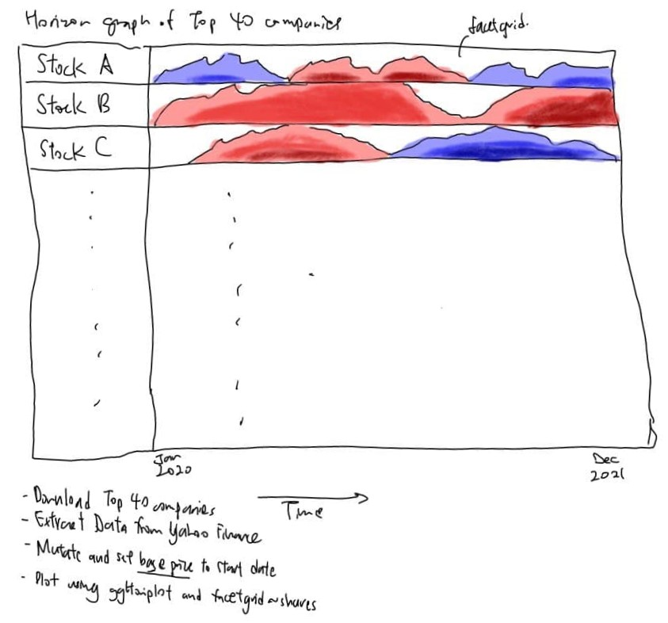

```{r setup, include=FALSE}
knitr::opts_chunk$set(echo = TRUE)
```

# Overview


Financial instruments such as stocks and bonds are usually tracked using time-series data, which show the change in price of an asset over time. The role of financial analysts is to identify trends, correlations, and seasonality changes to develop strategies to get an edge in the financial markets. To determine this behaviour, analysts typically explore how the properties and prices of an asset change over time.


# Getting Started


In this exercise, we will firstly scrape stock prices of top 40 comapnies in Singapore by market capitalisation using the [**tidyquant**](https://business-science.github.io/tidyquant/index.html) package, and then use a horizon graph to visualise the historical stock prices.


## Sketch of Design



# Horizon Plot


The Horizon Plot was conceived by [*Panopticon*](https://en.wikipedia.org/wiki/Panopticon_Software), a data visualisation company that has since been acquired. It is discussed in detail by Stephen Few in [*this article*](http://www.perceptualedge.com/articles/visual_business_intelligence/time_on_the_horizon.pdf), which describes how a horizon plot is formed. 


It seems complicated at first, but it essentially can be broken down into a few steps for visualising. Line graphs are first plot with a reference level, usually the first day of the period. The colour red or blue is used to denote whether it is below or above the reference level respectively, while the intensity of the hue denotes the magnitude of the change. The negative values are then inverted and all the hues collapsed to fit in a set height.

With the horizon plot, it is easier to identify patterns and trends in stock prices for a *large group of companies*, compared to looking at numerous line graphs which can be hard to discern at a go.


## Loading the required libraries


For this exercise, we will make use of the usual [**tidyverse**](https://www.tidyverse.org/) package which contains the [*read_csv*](https://readr.tidyverse.org/reference/read_delim.html) function, **tidyquant** to scrape the data as mentioned earlier, [**ggplot2**](https://ggplot2.tidyverse.org/) and [**ggHoriPlot**](https://rivasiker.github.io/ggHoriPlot/index.html) to plot the horizon plot


```{r}
options(scipen=999)
packages = c('tidyverse', 'tidyquant', 'ggplot2', 'ggHoriPlot')

for (p in packages){
  if(!require(p, character.only = T)){
    install.packages(p)
  }
  library(p, character.only = T)
}
```

## Data Import


Firstly, we get the list of the largest companies in Singapore by market capitalisation from https://companiesmarketcap.com/singapore/largest-companies-in-singapore-by-market-cap/. The list is downloadable in csv form, which we will use to extract the stock symbols.

```{r}
sglargest <- read_csv("data/sglargestcompanies.csv")
```

Since there are more than 40 companies, we will extract the top 40 companies using the code below. We will also get the ticker symbols for the 40 companies by extracting the symbol column.

```{r}
sglargest40 <- sglargest %>%
  filter(Rank <= 40)

top40 <- sglargest40$Symbol
```

We will now make use of the [**tidyquant**](https://business-science.github.io/tidyquant/index.html) package, which extracts the stock prices from Yahoo Finance.

```{r}
stock_prices <- tq_get(top40, 
                      get = "stock.prices", 
                      from = "2020-01-01",
                      to = "2021-12-31")
```

```{r}
head(stock_prices)
```

We now have a tibble form of data with all the prices for the top 40 companies.


## Data Wrangling


Since we are interested in the price of the stocks over time, we will be looking at either the Open, Close or Adjusted Close prices. As the top 40 stocks of Singapore consists of a large proportion of Finance, Utilities and REITs, most of them give big **dividends** which will affect their prices over time.

Hence, we will use the **Adjusted Close** prices, which accounts for these corporate actions and allows us to understand the time series data better.

We will calculate the change in prices for the horizon plot. We use the [*group_by*](https://dplyr.tidyverse.org/reference/group_by.html) and [*arrange*](https://dplyr.tidyverse.org/reference/arrange.html) to ensure that each stock is calculated based on each group and symbol, in the correct date order. Next, we use the [*mutate*](https://dplyr.tidyverse.org/reference/mutate.html) function to help us calculate the price relative to the first data point (set to a base of 1). 

```{r, code_folding = FALSE}
stock_prices2 <- stock_prices %>%
  group_by(symbol) %>%
  arrange(date, .by_group = TRUE) %>%
  mutate(adj_base = (adjusted/first(adjusted))) %>%
  ungroup()
```

We then use the [*left_join*](https://dplyr.tidyverse.org/reference/mutate-joins.html) to add our stock names to the data frame for the plot, as the scrapped data does not contain the names. We also clean up the Name column by replacing certain strings and combine it with the symbol as it will be used to label the stocks on the plot after.


```{r, code_folding = FALSE}
stock_prices3 <- left_join(stock_prices2, sglargest40,
                  by = c("symbol" = "Symbol"))
stock_prices3$Name <- gsub("amp;", "", stock_prices3$Name)
stock_prices3$Name <- paste0(stock_prices3$Name, " (", stock_prices3$symbol, ")")
```


## Computing statistics


For the horizon plot, we have to set an origin and a scale for the colours to display correctly.

```{r, code_folding = FALSE}
ori <- 1
sca <- c(0.64, 0.76, 0.88, 1, 1.12, 1.24, 1.36)
```

Since the data has been adjusted to a base of 1, the origin can be set at 1. For the scale, we have to use values that makes sense.

A popular heatmap for visualising stock prices is [*Finviz*](https://finviz.com/map.ashx). 


From there, we can toggle the performance time interval from one day until one year. The "**6 Months Performance**" is using a scale from -24% to +24% in intervals of 8%, while the "**1 Year Performance**" is using a scale from -30% to +30% in intervals of 10%. Hence, I decided to use a scale of **-36% to +36%** in intervals of 12% for a dataset of **two years**.


## Plotting using ggHoriPlot and facet_grid


We can now make use of the adjusted price data to plot the basic horizon plot using the code below. The geom_horizon will plot a horizon plot with the specified origin and scale, and then we can fill the scale using a Red-Blue palette. We then add a facet_grid with all the stock names for us to plot everything together.


```{r, code_folding = FALSE}
ggplot(stock_prices3) +
  geom_horizon(aes(date, 
                   adj_base,
                   fill = ..Cutpoints..), 
               origin = ori, horizonscale = sca) +
  scale_fill_hcl(palette = "RdBu") +
  facet_grid(Name~.)
```

We make further adjustments to the theme, labels, and annotations for easier comparison.

+ strip.text.y refers to the stock prices labels;
+ axis.text.x refers to the time stamps, which we rotate 90 degrees counter-clockwise;
+ Most of the other elements are blank for clarity;
+ panel.background is set to white (NA) so that we can see the change in hue better;
+ scale_x_date is set to intervals of 1 month with the format %b %y, which means Mmm YYYY;
+ Lastly, we can add the labels for the graph including the legend and the title.


```{r, layout="l-page", code_folding = FALSE}
p1 <- ggplot(stock_prices3) +
  geom_horizon(aes(date, 
                   adj_base,
                   fill = ..Cutpoints..), 
               origin = ori, horizonscale = sca) +
  scale_fill_hcl(palette = "RdBu") +
  facet_grid(Name~.) +
  theme(
    panel.spacing.y=unit(0, "lines"),
    strip.text.y = element_text(size = 5, angle = 0, hjust = 0),
    axis.text.y = element_blank(),
    axis.text.x = element_text(size = 4, angle=90),
    axis.title.y = element_blank(),
    axis.title.x = element_blank(),
    axis.ticks.y = element_blank(),
    panel.border = element_blank(),
    panel.background = element_rect(linetype = 1,
                                    fill = NA, 
                                    colour = "grey30"),
    ) +
  scale_x_date(expand=c(0,0),
               date_breaks = "1 month", 
               date_labels = "%b %y") +
  labs(fill = "% Change",
       title = "Change in Prices of Top 40 Listed Singapore Companies by Market Cap")

p1
```

# Conclusion

### Observation 1: There is a sharp dip across the board due to COVID-19 


At around mid Feb 2020, stock markets around the world started declining due to the COVID-19 pandemic, up until April 2020. The crash can be easily seen on the chart, where a majority of stocks turn red at the same time, amounting to >12% of a decline in stock value as compared to 1st Jan 2020. Globally however, the rebound was quick and there was a bull run after April to close new highs after. Singapore stocks however did not follow the global trend as we can see from this horizon plot, as half of the stocks are still in the red.


### Observation 2: Different sectors of stocks perform differently, due to seasonal differences


The stocks that got hit the most are the hospitality and tourism stocks, such as Singapore Airlines (C6L), SATS (S58), and Genting Singapore (G13). These stocks rely on global travel and hence as the pandemic raged on, travel was severely cut to reduce the spread of COVID-19. 

The next sectors to get affected are the commercial Real Estate Industrial Trusts (REITs), which focus mainly on shopping malls and entertainment. In Singapore, many of these malls faced restriction in not only capacity, but disallowing dine-in for F&B outlets which reduces footfall to these malls. Many of the shops in the mall thus have high turnover, and a number of malls actually remained deserted for fear of sudden changes in policy.

Lastly, the ones who get experience a decline are banks. As a result of expansionary monetary policy in the US to lower interest rates and provide funding for hard-hit companies, interest rates globally declined as well. This affects banks such as DBS (D05), UOB (U11) and OCBC (O39), as they make a profit from interest rates. They thus recovered far later than other stocks on the list.


### Observation 3: US-listed stocks performed way better on average


Although headquartered in Singapore, companies such as Sea (SE), Flex (FLEX), Kulicke & Soffa Industries, Inc (KLIC) and Kenon Holdings (KEN) followed the global trend as mentioned earlier. These companies dipped at the start of 2020, but ended much higher at the end of the period. This could be due to higher liquidity, and raised interest in the companies as they have a larger pool of investors.


### Observation 4: Newly listed stocks have a short and sharp rise, followed by a prolonged decline


We can see newly listed/IPO stocks such as Grab Holdings (GRAB), TDCX (TDCX), Triterras (TRIRF) and Karooooo (KARO) as they are only shaded on the horizon graph midway in the period. They all had a great start but declined after, which could be due to a variety of reasons. 

There are a record number of IPOs in 2021, hence the large pie of funding will need to be shared amongst many rivals. There can also be company troubles, such as large shareholders cashing out on the back of a strong market.